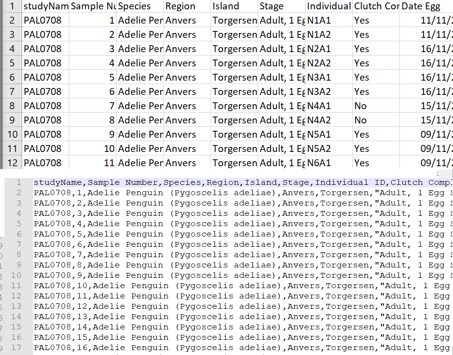
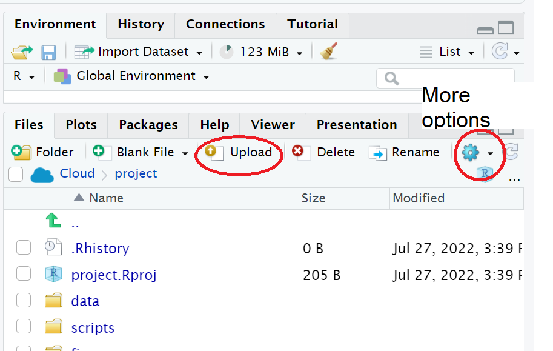

# Introduction to the tidyverse

```{r, child='_setup.Rmd'}
```

To load packages we use the function `library()`. Typically you would start any analysis script by loading all of the packages you need. 

The [tidyverse](https://www.tidyverse.org/) is an opinionated collection of R packages designed for data science. All packages share an underlying design philosophy, grammar, and data structures. This means the functions across the tidyverse are all designed to work together and make the process of data science easier.

### Load the tidyverse

Run the below code to load the tidyverse. You can do this regardless of whether you are using your own computer or the cloud.  

```{r library-load, eval = TRUE}
library(tidyverse)
```

You will get what looks like an error message - it's not. It's just R telling you what it's done. You should **read this** it gives you a full list of the packages it has made available to you. One of these should look familiar to you from last week?

`r mcq(c(answer = "ggplot2", "tibble", "tidyr", "dplyr"))`

Now that we've loaded the `tidyverse` package we can use **any** of the functions it contains but remember, you need to run the `library()` function every time you start R.

`r hide("Install the tidyverse. You DO NOT need to do this on RStudio Cloud.")`

In order to use a package, you must first install it. The following code installs the package tidyverse, a package we will use very frequently.

If you are working on your own computer, use the below code to install the tidyverse.


```{r, eval = F, echo = T}

install.packages("tidyverse")

```


You only need to install a package once, however, each time you start R you need to load the packages you want to use, in a similar way that you need to install an app on your phone once, but you need to open it every time you want to use it.

`r unhide()` 
<br>

```{block, type="danger"}

If you get an error message that says something like "WARNING: Rtools is required to build R packages" you may need to download and install an extra bit of software called [Rtools](https://cran.r-project.org/bin/windows/Rtools/).

```

## Package updates

In addition to updates to R and R Studio, the creators of packages also sometimes update their code. This can be to add functions to a package, or it can be to fix errors. One thing to avoid is unintentionally updating an installed package. When you run `install.packages()` it will always install the latest version of the package and it will overwrite any older versions you may have installed. Sometimes this isn't a problem, however, sometimes you will find that the update means your code no longer works as the package has changed substantially. It is possible to revert back to an older version of a package but try to avoid this anyway.

```{block, type="danger"}

To avoid accidentally overwriting a package with a later version, you should **never** include `install.packages()` in your analysis scripts in case you, or someone else runs the code by mistake. Remember, the server will already have all of the packages you need for this course so you only need to install packages if you are using your own machine.

```

## Package conflicts {#conflicts}

There are thousands of different R packages with even more functions. Unfortunately, sometimes different packages have the same function names. For example, the packages `dplyr` and `MASS` both have a function named `select()`. If you load both of these packages, R will produce a warning telling you that there is a conflict.

```{r package-conflict}
library(dplyr)
library(MASS)
```

In this case, R is telling you that the function `select()` in the `dplyr` package is being hidden (or 'masked') by another function with the same name. If you were to try and use `select()`, R would use the function from the package that was loaded most recently - in this case it would use the function from `MASS`.

If you want to specify which package you want to use for a particular function you can use code in the format `package::function`, for example:

```{r package-specify, eval=FALSE}
dplyr::select()
MASS::select()
```

## Objects

A large part of your coding will involve creating and manipulating objects. Objects contain stuff. That stuff can be numbers, words, or the result of operations and analyses.You assign content to an object using `<-`.

### Activity 5: Create some objects

* Copy and paste the following code into the console, change the code so that it uses your own name and age and run it. You should see that `name`, `age`, `today`, `new_year`, and `data` appear in the environment pane.  

```{r objects}

name <- "emily"
age <- 16 + 19 
today <-Sys.Date()
new_year <- as.Date("2022-01-01")
data <- rnorm(n = 10, mean = 15, sd = 3)

```

```{r img-objects-enviro, echo=FALSE, fig.cap="Objects in the environment"}

knitr::include_graphics("images/objects-enviro.png")

```

Note that in these examples, `name`,`age`, and `new_year` would always contain the values `emily`, `35`, and the date of New Year's Day 2021, however, `today` will draw the date from the operating system and `data` will be a randomly generated set of data so the values of these objects will not be static.

As a side note, if you ever have to teach programming and statistics, don't use your age as an example because every time you have to update your teaching materials you get a reminder of the fragility of existence and your advancing age. 2021 update: I have now given up updating my age, I will remain forever 35. 

Importantly, objects can be involved in calculations and can interact with each other. For example:

```{r objects-interact}

age + 10
new_year - today
mean(data)

```

Finally, you can store the result of these operations in a new object:

```{r objects-interact2}

decade <- age + 10

```

```{block, type="try"}
You may find it helpful to read `<-` as `contains`, e.g., `name` contains the text `emily`.
```

You will constantly be creating objects throughout this course and you will learn more about them and how they behave as we go along, however, for now it is enough to understand that they are a way of saving values, that these values can be numbers, text, or the result of operations, and that they can be used in further operations to create new variables.

```{block, type="info"}

You may also see objects referred to as 'variables'. There is a difference between the two in programming terms, however, they are used synonymously very frequently.

```

## Looking after the environment

If you've been writing a lot of code you may find that the environment pane (or workspace) has become cluttered with many objects. This can make it difficult to figure out which object you need and therefore you run the risk of using the wrong data frame. If you're working on a new dataset, or if you've tried lots of different code before getting the final version, it is good practice to remember to clear the environment to avoid using the wrong object. You can do this in several way.

1. To remove individual objects, you can type `rm(object_name)` in the console. Try this now to remove one of the objects you created in the previous section. 
2. To clear all objects from the environment run `rm(list = ls())` in the console.
3. To clear all objects from the environment you can also click the broom icon in the environment pane. 


```{r img-broom, echo=FALSE, fig.cap="Clearing the workspace"}

knitr::include_graphics("images/broom.png")

```

## Global options

By default, when you open R Studio it will show you what you were last working on, including your code and any objects you have created. This might sound helpful, but actually it tends to cause more problems than it's worth because it means that you risk accidentally using an old version of an object. We recommend changing the settings so that each time you start R Studio, it opens a fresh copy. You can do this by clicking `Tools` -  `Global Options` and then deselecting boxes so that it looks like the below.

```{r img-options, echo=FALSE, fig.cap="Global options"}

knitr::include_graphics("images/global_options.jpg")

```


## R sessions

When you open up R and start writing code, loading packages, and creating objects, you're doing so in a new **session**. In addition to clearing the workspace, it can sometimes be useful to start a new session. This will happen automatically each time you start R on your computer, although sessions can persist on the server. If you find that your code isn't working and you can't figure out why, it might be worth starting a new session. This will clear the environment and detach all loaded packages - think of it like restarting your phone.

### Activity 6

Click 'Session - Restart R'. 

```{r img-session, echo=FALSE, fig.cap="The truth about programming"}

knitr::include_graphics("images/new_session.png")

```

## How to cite R and RStudio

You may be some way off writing a scientific report where you have to cite and reference R, however, when the time comes it is important to do so to the people who built it (most of them for free!) credit. You should provide separate citations for R, RStudio, and the packages you use.

To get the citation for the version of R you are using, simply run the `citation()` function which will always provide you with he most recent citation.

```{r citation}
citation()
```

To generate the citation for any packages you are using, you can also use the `citation()` function with the name of the package you wish to cite.

```{r cite-tidy}
citation("tidyverse")
```

To generate the citation for the version of RStudio you are using, you can use the `RStudio.Version()` function:

```{r eval = FALSE}
RStudio.Version()
```

Finally, here's an example of how that might look in the write-up of your method section:

> Analysis was conducted using R ver 4.0.0 (R Core Team, 2020), RStudio (Rstudio Team, 2020), and the tidyverse range of packages (Wickham, 2017).

As noted, you may not have to do this for a while, but come back to this when you do as it's important to give the open-source community credit for their work.

## Help and additional resources

```{r img-kitteh, echo=FALSE, fig.cap="The truth about programming"}

knitr::include_graphics("images/kitteh.png")

```

Getting good at programming really means getting good trying stuff out,  searching for help online, and finding examples of code to copy. If you are having difficulty with any of the exercises contained in this book then you can ask for help on Teams, however, learning to problem-solve effectively is a key skill that you need to develop throughout this course. 

* Use the help documentation. If you're struggling to understand how a function works, remember the `?function` and `help()` command.
* If you get an error message, copy and paste it in to Google - it's very likely someone else has had the same problem.
* Rememver to ask for help on the course Yammer page
* In addition to these course materials there are a number of excellent resources for learning R:
  * [R Cookbook](http://www.cookbook-r.com/)
  * [StackOverflow](https://stackoverflow.com/)
  * [R for Data Science](https://r4ds.had.co.nz/)
  * Search or use the [#rstats](https://twitter.com/search?f=tweets&q=%23rstats&src=typd) hashtag on Twitter


## Debugging tips

A large part of coding is trying to figure why your code doesn't work and this is true whether you are a novice or an expert. As you progress through this course  you should keep a record of mistakes you make and how you fixed them. In each chapter we will provide a number of common mistakes to look out for but you will undoubtedly make (and fix!) new mistakes yourself.

* Have you loaded the correct packages for the functions you are trying to use? One very common mistake is to write the code to load the package, e.g., `library(tidyverse)` but then forget to run it.
* Have you made a typo? Remember `data` is not the same as `DATA` and `t.test` is not the same as `t_test`.
* Is there a package conflict? Have you tried specifying the package and function with `package::function`?
* Is it definitely an error? Not all red text in R means an error - sometimes it is just giving you a message with information. 

### Activity 7: Test yourself

**Question 1.** Why should you never include the code `install.packages()` in your analysis scripts? `r mcq(c("You should use library() instead", "Packages are already part of Base R", answer = "You (or someone else) may accidentally install a package update that stops your code working", "You already have the latest version of the package"))` 


`r hide("Explain This Answer")`
```{r, echo = FALSE, results='asis'}
cat("Remember, when you run `install.packages()` it will always install the latest version of the package and it will overwrite any older versions of the package you may have installed.")
```
`r unhide()` 
<br>
**Question 2.**What will the following code produce?
  
```{r, eval = FALSE}

rnorm(6, 50, 10)

```

`r mcq(c("A dataset with 10 numbers that has a mean of 6 and an SD of 50",answer = "A dataset with 6 numbers that has a mean of 50 and an SD of 10", "A dataset with 50 numbers that has a mean of 10 and an SD of 6", "A dataset with 50 numbers that has a mean of 10 and an SD of 6"))`  

`r hide("Explain This Answer")`
```{r, echo = FALSE, results='asis'}
cat("The default form for `rnorm()` is `rnorm(n, mean, sd)`. If you need help remembering what each argument of a function does, look up the help documentation by running `?rnorm`")
```
`r unhide()`  
<br>
**Question 3.** If you have two packages that have functions with the same name and you want to specify exactly which package to use, what code would you use? 

`r mcq(c(answer = "package::function", "function::package", "library(package)", "install.packages(package)"))`  

`r hide("Explain This Answer")`
```{r, echo = FALSE, results='asis'}
cat("You should use the form `package::function`, for example `dplyr::select`. Remember that when you first load your packages R will warn you if any functions have the same name - remember to look out for this!")
```
`r unhide()`  

**Question 4.** Which of the following is most likely to be an argument? `r mcq(sample(c("read_csv()", answer = "35", "<-")))`

**Question 5.** An easy way to spot functions is to look for `r mcq(sample(c(answer = "brackets", "numbers", "computers")))`.

**Question 6.** The job of `<-` is to send the output from the function to a/an `r mcq(sample(c("assignment", "argument", answer = "object")))`.

# Working with data

```{r, child='_setup.Rmd'}
```

In this workshop we work through loading data. Once we have a curated and cleaned dataset we can work on generating insights from the data.

As a biologist you should be used to asking questions and gathering data. It is also important that you learn all aspects of the research process. This includes responsible data management (understanding data files & spreadsheet organisation, keeping data safe) and data analysis.

In this chapter we will look at the structure of data files, and how to read these with R. We will also continue to develop reproducible scripts. This means that we are writing scripts that are well organised and easy to read, and also making sure that our scripts are complete and capable of reproducing an analysis from start to finish. 

Transparency and reproducibility are key values in scientific research, when you analyse data in a reproducible way it means that others can understand and check your work. It also means that the most important person can benefit from your work, YOU! When you return to an analysis after even a short break, you will be thanking your earlier self if you have worked in a clear and reproducible way, as you can pick up right where you left off.  


## Meet the Penguins

We have chosen to continue working with a dataset you have been introduced to already - the Palmer Penguins dataset. Previously we loaded a cleaned dataset, very quickly using an R package. Today we will be working in a more realistic scenario - uploading our data from a spreadsheet into our R workspace.

This data, taken from the `palmerpenguins` (@R-palmerpenguins) package was originally published by @Antarctic. In our course we will work with real data that has been shared by other researchers.

The palmer penguins data contains size measurements, clutch observations, and blood isotope ratios for three penguin species observed on three islands in the Palmer Archipelago, Antarctica over a study period of three years.

```{r, eval=TRUE, echo=FALSE, out.width="80%", fig.alt= "Photo of three penguin species, Chinstrap, Gentoo, Adelie"}
knitr::include_graphics("images/gorman-penguins.jpg")
```

These data were collected from 2007 - 2009 by Dr. Kristen Gorman with the Palmer Station Long Term Ecological Research Program, part of the US Long Term Ecological Research Network. The data were imported directly from the Environmental Data Initiative (EDI) Data Portal, and are available for use by CC0 license (“No Rights Reserved”) in accordance with the Palmer Station Data Policy. We gratefully acknowledge Palmer Station LTER and the US LTER Network. Special thanks to Marty Downs (Director, LTER Network Office) for help regarding the data license & use. Here is our intrepid package co-author, Dr. Gorman, in action collecting some penguin data:

```{r, eval=TRUE, echo=FALSE, out.width="80%", fig.alt= "Photo of Dr Gorman in the middle of a flock of penguins"}
knitr::include_graphics("images/penguin-expedition.jpg")
```

Here is a map of the study site

```{r, eval=TRUE, echo=FALSE, out.width="80%", fig.alt= "Antarctic Peninsula and the Palmer Field Station"}
knitr::include_graphics("images/antarctica-map.png")
```

## Activity 1: Organising our workspace

Before we can begin working with the data, we need to do some set-up. 

* Go to RStudio Cloud and open this week's R project

* Create the following folders using the + New Folder button in the Files tab

  * data
  * figures
  * scripts

```{block, type = "warning"}
R is case-sensitive so type everything exactly as printed here
```

Having these separate subfolders within our project helps keep things tidy, means it's harder to lose things, and lets you easily tell R exactly where to go to retrieve data.  

The next step of our workflow is to have a well organised project space. RStudio Cloud does a lot of the hard work for you, each new data project can be set up with its own Project space. 

We will define a project as a series of linked questions that uses one (or sometimes several) datasets. For example a coursework assignment for a particular module would be its own project, or eventually your final year research project. 

A Project will contain several files, possibly organised into sub-folders containing data, R scripts and final outputs. You might want to keep any information (wider reading) you have gathered that is relevant to your project.

```{r, eval=TRUE, echo=FALSE, out.width="80%", fig.cap = "An example of a typical R project set-up"}
knitr::include_graphics("images/project.png")
```

Within this project you will notice there is already one file *.Rproj*. This is an R project file, this is a very useful feature, it interacts with R to tell it you are working in a very specific place on the computer (in this case the cloud server we have dialed into). It means R will automatically treat the location of your project file as the 'working directory' and makes importing and exporting easier^[More on projects can be found in the R4DS book (https://r4ds.had.co.nz/workflow-projects.html)]. 

## Activity 2: Access our data

Now that we have a project workspace, we are ready to import some data.

* Use the link below to open a page in your browser with the data open

* Right-click Save As to download in csv format to your computer (Make a note of **where** the file is being downloaded to e.g. Downloads)

* Compare how the data looks in "raw" format to when you open the same data with Excel

```{r, eval = TRUE, echo = FALSE}
downloadthis::download_link(
  link = "https://raw.githubusercontent.com/UEABIO/data-sci-v1/main/book/files/penguins_raw.csv",
  button_label = "Download penguin data as csv",
  button_type = "success",
  has_icon = TRUE,
  icon = "fa fa-save",
  self_contained = FALSE
)
```


At first glance the data might look quite strange and messy. It has been stored as a **CSV** or comma-separated values file. CSV files are plain text files that can store large amounts of data, and can readily be imported into a spreadsheet or storage database. 

These files are the simplest form of database, no coloured cells, no formulae, no text formatting. Each row is a row of the data, each value of a row (previously separate columns) is separated by a comma. 

This file format helps us maintain an ethos **Keep Raw Data Raw** - 

In many cases, the captured or collected data may be unique and impossible to reproduce, such as measurements in a lab or field observations. For this reason, they should be protected from any possible loss. Every time a change is made to a raw data file it threatens the integrity of that information.

In practice, that means we only use our data file for data entry and storage. All the data manipulation, cleaning and analysis happens in R, using transparent and reproducible scripts.

```{block, type = "info"} 
We avoid saving files in the Excel format because they have a nasty habit of formatting or even losing data when the file gets large enough.

[https://www.theguardian.com/politics/2020/oct/05/how-excel-may-have-caused-loss-of-16000-covid-tests-in-england]. 

If you need to add data to a csv file, you can always open it in an Excel-like program and add more information, but remember to save it in the original csv format afterwards.
```

```{r, eval=TRUE, echo=FALSE, out.width="80%", fig.alt= "excel view, csv view", fig.cap = "Top image: Penguins data viewed in Excel, Bottom image: Penguins data in native csv format"}

```

In raw format, each line of a CSV is separated by commas for different values. When you open this in a spreadsheet program like Excel it automatically converts those comma-separated values into tables and columns. 


## Activity 3: Upload our data

* The data is now in your Downloads folder on your computer

* We need to upload the data to our remote cloud-server (RStudio Cloud), select the upload files to server button in the Files tab

* Put your file into the data folder - if you make a mistake select the tickbox for your file, go to the cogs button and choose the option Move.

```{r, eval=TRUE, echo=FALSE, out.width="80%", fig.alt= "File tab", fig.cap = "Highlighted the buttons to upload files, and more options"}

```

## Activity 4: Make a script

Let's now create a new R script file in which we will write instructions and store comments for manipulating data, developing tables and figures. Use the File > New Script menu item and select an R Script. 

Add the following:

```{r}
#___________________________----
# SET UP ---
## An analysis of the bill dimensions of male and female Adelie, Gentoo and Chinstrap penguins ----

### Data first published in  Gorman, KB, TD Williams, and WR Fraser. 2014. “Ecological Sexual Dimorphism and Environmental Variability Within a Community of Antarctic Penguins (Genus Pygoscelis).” PLos One 9 (3): e90081. https://doi.org/10.1371/journal.pone.0090081. ----
#__________________________----

```

Then load the following add-on package to the R script, just underneath these comments. Tidyverse isn't actually one package, but a bundle of many different packages that play well together - for example it *includes* `ggplot2` which we used in the last session, so we don't have to call that separately

```{r}
# PACKAGES ----
library(tidyverse) # tidy data packages
library(janitor) # cleans variable names
library(lubridate) # make sure dates are processed properly
#__________________________----
```

```{task}
Save this file inside the scripts folder and call it `01_import_penguins_data.R`
```

## Activity 5: Read in data

Now we can read in the data. To do this we will use the function `read_csv()` that allows us to read in .csv files. There are also functions that allow you to read in .xlsx files and other formats, however in this course we will only use .csv files.

* First, we will create an object called `penguins_data` that contains the data in the `penguins_raw.csv` file. 

```{r readpenguin, eval = FALSE}
# IMPORT DATA ----
penguins_data <- read_csv ("data/penguins_raw.csv")

head(penguins_data) # check the first lines of the dataframe
#__________________________----
```


```{block, type="danger"}
There is also a function called `read.csv()`. Be very careful NOT to use this function instead of `read_csv()` as they have different ways of naming columns. 
```

### Filepath


## Activity 6: Clean the data

We are going to learn how to organise data using the *tidy* format^[(http://vita.had.co.nz/papers/tidy-data.pdf)]. This is because we are using the `tidyverse` packages @R-tidyverse. This is an opinionated, but highly effective method for generating reproducible analyses with a wide-range of data manipulation tools. Tidy data is an easy format for computers to read. 

Here 'tidy' refers to a specific structure that lets us manipulate and visualise data with ease. In a tidy dataset each *variable* is in one column and each row contains one *observation*. Each cell of the table/spreadsheet contains the *values*. One observation you might make about tidy data is it is quite long - it generates a lot of rows of data. 

```{r, eval=TRUE, echo=FALSE, out.width="80%", fig.alt= "tidy data overview"}
knitr::include_graphics("images/tidy-1.png")
```

So we know our data is in R, and we know the columns and names have been imported. But we still don't know whether all of our values imported, or whether it captured all the rows. 

There are lots of different ways to view and check data. One useful method is `glimpse`

```{r, eval = F}
# CHECK DATA ----
# check the data
colnames(penguins_data)
#__________________________----
```

When we run `colnames()` we get the identities of each column in our dataframe

* **Study name**: an identifier for the year in which sets of observations were made

* **Region**: the area in which the observation was recorded

* **Island**: the specific island where the observation was recorded

* **Stage**: Denotes reproductive stage of the penguin

* **Individual** ID: the unique ID of the individual

* **Clutch completion**: if the study nest observed with a full clutch e.g. 2 eggs

* **Date egg**: the date at which the study nest observed with 1 egg

* **Culmen length**: length of the dorsal ridge of the bird's bill (mm)

* **Culmen depth**: depth of the dorsal ridge of the bird's bill (mm)

* **Flipper Length**: length of bird's flipper (mm)

* **Body Mass**: Bird's mass in (g)

* **Sex**: Denotes the sex of the bird

* **Delta 15N** : the ratio of stable Nitrogen isotopes 15N:14N from blood sample

* **Delta 13C**: the ratio of stable Carbon isotopes 13C:12C from blood sample


### Refine variable names

Often we might want to change the names of our variables. They might be non-intuitive, or too long. Our data has a couple of issues:

* Some of the names contain spaces

* Some of the names contain brackets

R does not like these so let's correct these quickly.

```{r, eval = F}
# CLEAN DATA ----

# clean all variable names to snake_case using the clean_names function from the janitor package
# note we are using assign <- to overwrite the old version of penguins with a version that has updated names
# this changes the data in our R workspace but NOT the original csv file

penguins <- janitor::clean_names(penguins) # clean the column names

colnames(penguins) # quickly check the new variable names


```

The `clean_names` function quickly converts all variable names into snake case. The N and C blood isotope ratio names are still quite long though, so let's clean those with `dplyr::rename()` where "new_name" = "old_name".

```{r, eval = F}
# shorten the variable names for N and C isotope blood samples

penguins <- rename(penguins,
         "delta_15n"="delta_15_n_o_oo",  # use rename from the dplyr package
         "delta_13c"="delta_13_c_o_oo")

```


### Check data format

When we run `glimpse()` we get several lines of output. The number of observations "rows", the number of variables "columns". Check this against the csv file you have - they should be the same. In the next lines we see variable names and the type of data. 

```{r, eval = F}
glimpse(penguins)
```

We can see a dataset with 345 rows (including the headers) and 17 variables
It also provides information on the *type* of data in each column

* `<chr>` - means character or text data

* `<dbl>` - means numerical data

Is `body_mass_g` in the correct data format?

`r mcq(c(answer = "no", "yes"))`

This is where we start to use some of the core functions from `tidyverse`.

If R thinks `Body Mass (g)` is a character variable, then it probably contains some words as well as numbers. So let's have a look at this and compare it to another column that IS treated as numerical. 

```{r, eval = F}
# check for the unique values in body_mass_g
select(penguins, 
       body_mass_g, 
       flipper_length_mm)
```

```{block, type="info"}
One feature that will quickly become apparent (and very useful), is that the first argument in every tidyverse function is always the dataframe. The above code could have been written as

``select(.data = penguins, 
       body_mass_g, 
       flipper_length_mm)
``
But why bother?

```


```{r, eval=TRUE, echo=FALSE, out.width="80%"}
knitr::include_graphics("images/NA.png")
```

Let's fix that

```{r, eval = F}

replace_na(penguins, body_mass_g)

### Dates

We can also see there is a `date_egg` variable. If you check it (using any of the new functions you have learned), you should see that it all looks like its been inputted correctly, but R is treating it as words, rather than assigning it a date value. We can fix that with the `lubridate` package. If we use the function `dmy` then we tell R this is date data in date/month/year format. 

```{r, eval = F}
# use dmy from stringr package to encode date properly
penguins <- penguins %>% 
  mutate(date_egg_proper=dmy(date_egg))
```


Here we use the `mutate` function from `dplyr` to create a new variable called `date_egg_proper` based on the output of converting the characters in `date_egg` to date format. The original variable is left intact, if we had specified the "new" variable was also called `date_egg` then it would have overwritten the original variable. 

### Rename some values

Sometimes we may want to rename the values in our variables in order to make a shorthand that is easier to follow.

```{r, eval = F}
# use mutate and case_when for an if-else statement that changes the names of the values in a variable
penguins <- penguins %>% 
  mutate(species = case_when(species == "Adelie Penguin (Pygoscelis adeliae)" ~ "Adelie",
                             species == "Gentoo penguin (Pygoscelis papua)" ~ "Gentoo",
                             species == "Chinstrap penguin (Pygoscelis antarctica)" ~ "Chinstrap"))

```

### Check for duplication

It is very easy when inputting data to make mistakes, copy something in twice for example, or if someone did a lot of copy-pasting to assemble a spreadsheet (yikes!). We can check this pretty quickly

```{r, eval = F}
# check for duplicate rows in the data
penguins %>% 
  duplicated() %>% # produces a list of TRUE/FALSE statements for duplicated or not
  sum() # sums all the TRUE statements

```

```
[1] 0
```
Great! 

### Check for typos or implausible values

We can also  explore our data for very obvious typos by checking for implausibly small or large values

```{r, eval = F}
# use summarise to make calculations
penguins %>% 
  summarise(min=min(body_mass_g, na.rm=TRUE), 
            max=max(body_mass_g, na.rm=TRUE))

```

The minimum weight for our penguins is 2.7kg, and the max is 6.3kg - not outrageous. If the min had come out at 27g we might have been suspicious. We will use `summarise` again to calculate other metrics in the future. 

```{block, type = "information"} 
our first data insight, the difference the smallest adult penguin in our dataset is nearly half the size of the largest penguin. 
```
We can also look for typos by asking R to produce all of the distinct values in a variable. This is more useful for categorical data, where we expect there to be only a few distinct categories

```{r, eval = F}
penguins %>% 
  distinct(sex)

```
Here if someone had mistyped e.g. 'FMALE' it would be obvious. We could do the same thing (and probably should have before we changed the names) for species. 

### Missing values: NA

There are multiple ways to check for missing values in our data

```{r, eval = F}
# Get a sum of how many observations are missing in our dataframe
penguins %>% 
  is.na() %>% 
  sum()

```

But this doesn't tell us where these are, fortunately the function `summary` does this easily

```{r, eval = F}
# produce a summary of our data
summary(penguins)

```

This provides a quick breakdown of the max and min for all numeric variables, as well as a list of how many missing observations there are for each one. As we can see there appear to be two missing observations for measurements in body mass, bill lengths, flipper lengths and several more for blood measures. We don't know for sure without inspecting our data further, *but* it is likely that the two birds are missing multiple measurements, and that several more were measured but didn't have their blood drawn. 

We will leave the NA's alone for now, but it's useful to know how many we have. 

We've now got a clean & tidy dataset!! 

## Summing up

## Figures


## Preparing the data


### View and refine

So we know our data is in R, and we know the columns and names have been imported. But we still don't know whether all of our values imported, or whether it captured all the rows. 

There are lots of different ways to view and check data. One useful method is `glimpse`

```{r, eval = F}
# check the structure of the data
glimpse(penguins)
```

When we run `glimpse()` we get several lines of output. The number of observations "rows", the number of variables "columns". Check this against the csv file you have - they should be the same. In the next lines we see variable names and the type of data. 

We should be able to see by now, that all is not well!!!  `Body Mass (g)` is being treated as character (string), as is `Date Egg`, meaning R thinks these contain letters and words instead of numbers and dates. 

Other ways to view the data

* type `penguins` into the Console

* type `view(penguins)` this will open a spreadsheet in a new tab

* type `head(penguins)` will show the first 10 lines of the data, rather than the whole dataset

> **Note - `view()` lets you do cool stuff like reorder rows and quickly scroll through the dataset without affecting the underlying data. 

### Data management

We've imported the data, checked it and found some inconsistencies. 

This is where we start to use some of the core functions from `tidyverse`.

If R thinks `Body Mass (g)` is a character variable, then it probably contains some words as well as numbers. So let's have a look at this and compare it to a variable which has been processed correctly

```{r, eval = F}
# get the first 10 rows of the Flipper Length and Body Mass variables
penguins %>% 
  select(`Flipper Length (mm)`, 
         `Body Mass (g)`) %>% 
  head(10) # 10 rows
```

```{r, eval=TRUE, echo=FALSE, out.width="80%"}
knitr::include_graphics("images/NA.png")
```

> **Note - What is the %>% ??? It's known as a pipe. It sends the results of one line of code to the next. So the data penguins is sent to the `select` function which picks only those variables we want. The result of this is then sent to the `head` function which with the argument for number of rows set to 10, prints the top 10 rows. 

> The other way to write this series of functions would be to use brackets and the rules of BODMAS:

```
head(select(penguins, `Flipper Length (mm)`, `Body Mass (g)`),10)
```
> Hopefully you agree that the pipes make the code a lot more human-reader friendly. More on pipes later

So what's the problem with our data? in the Flipper length variable, missing observations have been correctly marked as `NA` signifying missing data. R can handle missing data just fine. However, in thew Body mass variable, it looks as though someone has actually typed "na" in observations where the data is missing. Here R has failed to recognise an `NA` and has read it as a word instead. This is because `read_csv()` looks for gaps or `NA` but not the typed letters "na". 

No problem this is an easy fix. Head back to your script and make the following edit the line for data importing

```{r, eval = F}
# read in the penguins data, specify that NA strings can be "na" or "NA"
penguins <- read_csv("data/penguin_data.csv", na=c("na","NA"))
```

Now re-check your data using the same lines of code from before.
All ok now? 

## Dataframes and tibbles

A quick sidebar on how R stores data. When we imported the data into R it ws put into an object called a **tibble** which is a type of **dataframe**. 

Let's have a quick go at making our own **tibble** from scratch. 

Make a new script called 'TibbleTrouble.R' in the scripts folder as before. 

At the top of this new script put 

```{r, eval = F}
# just me messing about making tibbles

# libraries
library(tidyverse)

# make some variables, when we have a one dimensional object like this it is known as an atomic vector!
person <- c("Mark", "Phil", "Becky", "Tony")
hobby <- c("kickboxing", "coding", "dog walking", "car boot sales")
awesomeness <- c(1,100,1,1)
```

The function `c` lets you 'concatenate' or link each of these arguments together into a single vector.

Now we put these vectors together, where they become the variables in a new tibble

```{r, eval = F}
# make a tibble
my_data <- tibble(person, hobby, awesomeness)
my_data
```

```
# A tibble: 4 x 3
  person hobby          awesomeness
  <chr>  <chr>                <dbl>
1 Mark   kickboxing               1
2 Phil   coding                 100
3 Becky  dog walking              1
4 Tony   car boot sales           1
```
Have a go at messing about with your script and figure out what each of these does, add comments and save your script.

```{r, eval = F}
# Some R functions for looking at tibbles and dataframes I will comment next to each one with what it does

head(my_data, n=2)
tail(my_data, n=1)
nrow(my_data)
ncol(my_data)
colnames(my_data)
view(my_data)
glimpse(my_data)
str(my_data)


```

## Clean and tidy

Back to your penguins script. 

We have checked the data imported correctly, now its time to *clean and tidy* the data. 

### Tidy

In this example our data is already in `tidy` format i.e. one observation per row. We will cover what to do if data isn't tidy later.

### Clean

Here are a few things we might want to do to our data to make it 'clean'. 

* Refine variable names

* Format dates and times

* Rename some values

* Check for any duplicate records

* Check for any implausible data or typos

* Check and deal with missing values

> **Note - Remember because we are doing everything in a script, the original data remains unchanged. This means we have data integrity, and a clear record of what we did to tidy and clean a dataset in order to produce summaries and data visuals


### What we learned

There was a lot of preparation here, and we haven't really got close to make any major insights. But you have: 

* Organised your project space

* Dealt with file formats

* Put data into a specific location and imported into R

* Checked the data import

* Cleaned and tidied the data

You have also been introduced to the `tidyverse` and two of its packages

* `readr` @R-readr

* `dplyr` @R-dplyr

As well as:

* `janitor` @R-janitor

* `lubridate` @R-lubridate

### Quitting

```{block, type="warning"}
Remember to **save** your RScript before you leave. And ideally don't save your .Rdata!
```

* Close your RStudio Cloud Browser

* Go to Blackboard to complete this week's quiz!
