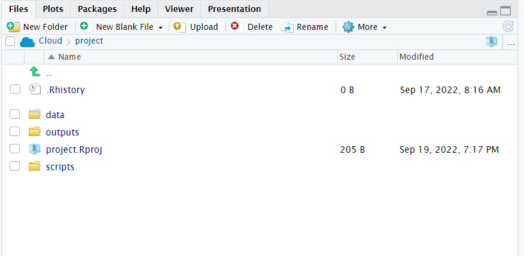
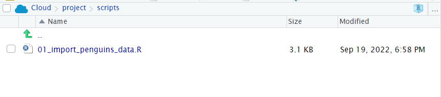

# Data wrangling part two

```{r, child= '_setup.Rmd'}

```

```{r, echo = F, warning = F, message = F}
load(here::here("book", "files", "chapter4.RData"))
library(tidyverse)
library(janitor)
library(lubridate)
```

## Load your workspace

You should have a workspace ready to work with the Palmer penguins data. Load this workspace now. 

Think about some basic checks before you start your work today.

### Checklist

* Are there objects already in your Environment pane? [There shouldn't be](#global-options), if there are use `rm(list=ls())`

* Re-run your script from [last time](#data-wrangling-part-one) from line 1 to the last line

* Check for any warning or error messages

* Add the code from today's session to your script as we go

## More summary tools

Very often we want to make calculations aobut groups of observations, such as the mean or median. We are often interested in comparing responses among groups. For example, we previously found the number of distinct penguins in our entire dataset.

```{block, type = "try"}
Add these new lines of code to your script as you try them.
Comment out # and add short descriptions of what you are achieving with them

```

```{r, eval = F}
penguins %>% 
  summarise(n_distinct(individual_id))

```

Now consider when the groups are subsets of observations, as when we find out the number of penguins in each species and sex.

```{r, eval = F}
penguins %>% 
  group_by(species, sex) %>% 
  summarise(n_distinct(individual_id))

```

As we progress, not only are we learning how to use our data wrangling tools. We are also gaining insights into our data. 

**Question** How many female Adelie penguins are in our dataset? 

`r fitb("65")`

<br>

**Question** How many Gentoo penguins **did not** have their sex recorded?

`r fitb("5")`

<br>

We are using summarise and group_by a lot! They are very powerful functions:

* `group_by` adds *grouping* information into a data object, so that subsequent calculations happen on a *group-specific* basis. 

* `summarise` is a data aggregation function thart calculates summaries of one or more variables, and it will do this separately for any groups defined by `group_by`

### Using summarise()

`summarise()` has a whole list of useful functions for producing *descriptive* statistics

```{r, eval = TRUE, echo = FALSE, warning = FALSE, message = FALSE}


verb <- c( "mean(), median()",
           "sd(), IQR()",
           "min(), max(), quantile()",
           "first(), last(), nth()",
           "n(), n_distinct()")

action <- c("Center data",
            "Spread of data",
            "Range of data",
            "Position",
            "Count")

box <- tibble(verb, action)

box

```

* `min` and `max` to calculate minimum and maximum values of a numeric vector

* `mean` and `median` to calculate averages of a numeric vector

* `sd` and `var` calculate standard deviation and variance of a numeric vector

Using `summarise` we can calculate the mean flipper and bill lengths of our penguins:

```{r, eval  = F}
penguins %>% 
  summarise(
    mean_flipper_length = mean(flipper_length_mm, na.rm=TRUE),
     mean_culmen_length = mean(culmen_length_mm, na.rm=TRUE))

```

```{block, type ="info"}
Note - we provide informative names for ourselves on the left side of the `=` 

When performing calculations in summarise it is important to set `na.rm = TRUE`, this removes missing values from the calculation
```

```{block, type = "try"}

What happens when you try to produce calculations that include `NA`? 
e.g `NA` + 4 or `NA` * 5

```


We can use several functions in `summarise`. Which means we can string several calculations together in a single step, and generate more insights into our data.

```{r, eval  = F}
penguins %>% 
  summarise(n=n(), # number of rows of data
            num_penguins = n_distinct(individual_id), # number of unique individuals
            mean_flipper_length = mean(flipper_length_mm, na.rm=TRUE), # mean flipper length
            prop_female = sum(sex == "FEMALE", na.rm=TRUE) / n()) # proportion of observations that are coded as female
            

```
`r hide("Solution")`

* There are 190 unique IDs and 344 total observations so it would appear that there are roughly twice as many observations as unique individuals. The sex ratio is roughly even (48% female) and the average flipper length is 201 mm.

`r unhide()`


### Summarize `across` columns


`across` has two arguments, `.cols` and `.fns`. 

* The `.cols` argument lets you select the columns you wish to apply functions to

* The `.fns` argument applies the required function to all of the selected columns. 


```{r, eval  = F}
# Across ----
# The mean of ALL numeric columns in the data, where(is.numeric == TRUE) hunts for numeric columns

penguins %>% 
  summarise(across(.cols = where(is.numeric), 
                   .fns = ~ mean(., na.rm=TRUE)))

```

The above example calculates the means of any & all numeric variables in the dataset. 

The below example is a slightly complicated way of running the n_distinct for summarise. The `.cols()` looks for any column that contains the word "penguin" and then runs the `n_distinct()`command on these

```{r, eval  = F}
# number of distinct penguins, as only one column contains the word penguin
# the argument contains looks for columns that match a character expression

penguins %>% 
  summarise(across(.cols = contains("individual"), 
                   .fns = ~n_distinct(.)))

```

### group_by revisited

The `group_by` function provides the ability to separate our summary functions according to any subgroups we wish to make. The real magic happens when we pair this with `summarise` and `mutate`.

In this example, by grouping on the individual penguin ids, then summarising by n - we can see how many times each penguin was monitored in the course of this study. 

```{r, eval  = F}
penguin_stats <- penguins %>% 
  group_by(individual_id) %>% 
  summarise(num=n())
```

```{block, type = "info"}
Remember the actions of `group_by` are "invisible". Subsequent functions are applied in a "grouped by" manner - but the dataframe itself looks unchanged.

```

### More than one grouping variable

What if we need to calculate by more than one variable at a time? 
No problem we can submit several arguments:

```{r, eval  = F}
penguins_grouped <- penguins %>% 
  group_by(sex, species)

```

 We can then calculate the mean flipper length of penguins in each of the six combinations

```{r, eval  = F}
penguins_grouped %>% 
summarise(mean_flipper = mean(flipper_length_mm, na.rm=TRUE))
```

Now the first row of our summary table shows us the mean flipper length (in mm) for female Adelie penguins. There are eight rows in total, six unique combinations and two rows where the sex of the penguins was not recorded(`NA`)

### using group_by with mutate

So far we have only used `group_by` with the `summarise` function, but this doesn't always have to be the case. 
When `mutate` is used with `group_by`, the calculations occur by 'group'. Here's an example:

```{r, eval  = F}
# Using mutate and group_by ----
centered_penguins <- penguins %>% 
  group_by(sex, species) %>% 
  mutate(flipper_centered = flipper_length_mm-mean(flipper_length_mm, na.rm=TRUE))

centered_penguins %>% 
  select(flipper_centered)
# Each row now returns a value for EACH penguin of how much greater/lesser than the group average (sex and species) its flipper is. 

```
Here we are calculating a **group centered mean**, this new variable contains the *difference* between each observation and the mean of whichever group that observation is in. 

### remove group_by

On occasion we may need to remove the grouping information from a dataset. This is often required when we string pipes together, when we need to work using a grouping structure, then revert back to the whole dataset again

Look at our grouped dataframe, and we can see the information on groups is at the top of the data:

```
# A tibble: 344 x 10
# Groups:   sex, species [8]
   species island culmen_length_mm culmen_depth_mm flipper_length_~ body_mass_g
   <chr>   <chr>           <dbl>         <dbl>            <dbl>       <dbl>
 1 Adelie  Torge~           39.1          18.7              181        3750
 2 Adelie  Torge~           39.5          17.4              186        3800
 3 Adelie  Torge~           40.3          18                195        3250
 ```


```{r, eval  = F}
# Run this command will remove the groups - but this is only saved if assigned BACK to an object

centered_penguins <- centered_penguins %>% 
  ungroup()

centered_penguins

```

Look at this output - you can see the information on groups has now been removed from the data. 


## Working with character strings

Datasets often contain words, and we call these words "(character) strings". 

Often these aren't quite how we want them to be, but we can manipulate these as much as we like. Functions in the package `stringr`, are fantastic. And the number of different types of manipulations are endless!

```{r, eval  = F}
# Stringr ----

str_replace_all(names(penguins), c("e"= "E"))
# replace all character "e" with "E"
```


### More stringr

```{r, eval  = F}
penguins %>% 
  mutate(species=str_to_upper(species))
# Capitalise all letters

```

```{r, eval  = F}
penguins %>% 
  mutate(species=str_remove_all(species, "e"))
# remove every character "e" from selected variables
```

We can also trim leading or trailing empty spaces with `str_trim`. These are often problematic and difficult to spot e.g.

```{r, eval  = F}
df2 <- tibble(label=c("penguin", " penguin", "penguin ")) 
df2 # make a test dataframe
```

We can easily imagine a scenario where data is manually input, and trailing or leading spaces are left in. These are difficult to spot by eye - but problematic because as far as R is concerned these are different values. We can use the function `distinct` to return the names of all the different levels it can find in this dataframe.

```{r, eval  = F}
df2 %>% 
  distinct()
```

If we pipe the data throught the `str_trim` function to remove any gaps, then pipe this on to `distinct` again - by removing the whitespace, R now recognises just one level to this data. 

```{r, eval  = F}
df2 %>% 
  mutate(label=str_trim(label, side="both")) %>% 
  distinct()

```

A quick example of how to extract partial strings according to a pattern is to use `str_detect`. Combined with `filter` it is possible to subset a dataframe by searching for all the strings that match provided information, such as all the penguin IDs that start with "N1"

```{r, eval  = F}
penguins %>% 
  filter(str_detect(individual_id, "N1"))

```

### separate

Sometimes a string might contain two pieces of information in one. This does not confirm to our tidy data principles. But we can easily separate the information with `separate()` from the `tidyr` package.

First we produce some made-up data

```{r}
df <- tibble(label=c("a-1", "a-2", "a-3")) 
#make a one column tibble
df
```

```{r}
df %>% 
  separate(label, # name of variable
           c("treatment", "replicate"), # new column names
           sep="-") # the character to mark where the separation occurs

```

We started with one variable called `label` and then split it into two variables, `treatment` and `replicate`, with the split made where `-` occurs. 
The opposite of this function is `unite()`

## Changing data formats

In the previous [worksheet](@glimpse-check-data-format), we used `glimpse()` to check the format of each of our variables. One of our variables `date_egg` isn't in a very helpful format. It has been read as a character string, this means there is no intrinsic order or values attached to the dates. Most likely this has happened because of the "/" symbols. When we have clearly non-numerical symbols in our variables, R will default to treating these as character variables. 

Luckily we can fix this using `mutate()` and `str_remove_all()`

```{task}
Remove the all the "/" elements from the `date_egg` variable
```

`r hide("Solution")`

Check your code

```{r, eval = F}
# DATES ----
penguins %>% 
  mutate(date_egg = str_remove_all(date_egg, "/"))

```

`r unhide()`

**Question** Does this now mean the `date_egg` variable is being treated as numeric? `r`

`r mcq(c("yes", answer = "no"))`

`r hide("Explain This Answer")`

```{r, echo = FALSE, results='asis'}
cat("Data formats are set only when reading the data in for the first time, if we wish to change them, then we need to do so explicitly using mutate()")
```

```{r, eval = F}
# add the as.numeric() function
penguins %>% 
  mutate(date_egg = as.numeric(str_remove_all(date_egg, "/"))) %>% 
  glimpse()

```

```{block, type = "info"}
There are as.numeric(), as.character(), as.logical() functions to convert data formats, these will only work if there are no "illegal" characters. So you may need to remove these first, as in the examples above.

```

`r unhide()` 

<br>


## Working with dates

We now know that we can change data formats easily, but treating date as strictly numeric is problematic, it won't account for number of days in months or number of months in a year. 

Additionally there's a lot of different ways to write the same date:

* 13-10-2019

* 10-13-2019

* 13-10-19

* 13th Oct 2019

* 2019-10-13

This variability makes it difficult to tell our software how to read the information, luckily we can use the functions in the `lubridate` package. 

Depending on how we interpret the date ordering in a file, we can use `ymd()`, `ydm()`, `mdy()`, `dmy()` 

* **Question** What is the appropriate function to use on the `date_egg` variable?

`r fitb("dmy()")`

```{block, type = "warning"}
If you get a warning that some dates could not be parsed, then you might find the date has been inconsistently entered into the dataset.

Pay attention to warning and error messages
```


`r hide("Solution")`


```{r, eval = T, warning = F, message = F}

penguins <- penguins %>%
  mutate(date_egg_proper = lubridate::dmy(date_egg))

```


Here we use the `mutate` function from `dplyr` to create a *new variable* called `date_egg_proper` based on the output of converting the characters in `date_egg` to date format. The original variable is left intact, if we had specified the "new" variable was also called `date_egg` then it would have overwritten the original variable. 

`r unhide()`

Once we have established our date data, we are able to perform calculations. Such as the date range across which our data was collected.  

```{r, eval = F}
penguins %>% 
  summarise(min_date=min(date_egg_proper),
            max_date=max(date_egg_proper))
```

### Calculations with dates

How many times was each penguin measured, and across what total time period?

```{r, eval = F}
penguins %>% 
  group_by(individual_id) %>% 
  summarise(first_observation=min(date_egg_proper), 
            last_observation=max(date_egg_proper), 
            study_duration = last_observation-first_observation, 
            n=n())
```

Cool we can also convert intervals such as days into weeks, months or years with `dweeks(1)`, `dmonths(1)`, `dyears(1)`.

As with all cool functions, you should check out the RStudio [cheat sheet](https://www.rstudio.com/resources/cheatsheets/) for more information. Date type data is common in datasets, and learning to work with it is a useful skill. 


```{r, eval = F}
penguins %>% 
  group_by(individual_id) %>% 
  summarise(first_observation=min(date_egg_proper), 
            last_observation=max(date_egg_proper), 
            study_duration_years = (last_observation-first_observation)/lubridate::dyears(1), 
            n=n()) %>% 
    arrange(desc(study_duration_years))

```


## Factors

In R, factors are a class of data that allow for **ordered categories** with a fixed set of acceptable values. 

Typically, you would convert a column from character or numeric class to a factor if you want to set an intrinsic order to the values (“levels”) so they can be displayed non-alphabetically in plots and tables, or for use in linear model analyses (more on this later). 

Another common use of factors is to standardise the legends of plots so they do not fluctuate if certain values are temporarily absent from the data.


```{r, eval = T, warning = F, message = F}
penguins <- penguins %>% 
  mutate(flipper_range = case_when(flipper_length_mm <= 190 ~ "small",
                                   flipper_length_mm >190 & flipper_length_mm < 213 ~ "medium",
                                   flipper_length_mm >= 213 ~ "large"))
```

If we make a barplot, the order of the values on the x axis will typically be in alphabetical order for any character data

```{r, eval = T, warning = F, message = F}
penguins %>% 
  ggplot(aes(x = flipper_range))+
  geom_bar()

```

To convert a character or numeric column to class factor, you can use any function from the `forcats` package. They will convert to class factor and then also perform or allow certain ordering of the levels - for example using `forcats::fct_relevel()` lets you manually specify the level order. 
The function `as_factor()` simply converts the class without any further capabilities.

The `base R` function `factor()` converts a column to factor and allows you to manually specify the order of the levels, as a character vector to its `levels =` argument.

Below we use `mutate()` and `fct_relevel()` to convert the column flipper_range from class character to class factor. 

```{r, eval = T, warning=FALSE, message = F}
penguins <- penguins %>% 
  mutate(flipper_range = fct_relevel(flipper_range))

```

```{r}
levels(penguins$flipper_range)
```

```{r}
# Correct the code in your script with this version
penguins <- penguins %>% 
  mutate(flipper_range = fct_relevel(flipper_range, "small", "medium", "large"))

```

Now when we call a plot, we can see that the x axis categories match the intrinsic order we have specified with our factor levels. 

```{r, eval = T, warning = F, message = F}
penguins %>% 
  ggplot(aes(x = flipper_range))+
  geom_bar()

```

## Finished

* Make sure you have **saved your script 💾**  and given it the filename "01_import_penguins_data.R" in the ["scripts" folder](#activity-1-organising-our-workspace).

* Make sure your workspace is set **not** to save objects from the environment [*between* sessions](#global-options).

* Does your workspace look like the below? 

```{r, eval=TRUE, echo=FALSE, out.width="100%",  fig.cap="My neat project layout"}

```

```{r, eval=TRUE, echo=FALSE, out.width="100%",  fig.cap="My scripts and file subdirectory"}

```

## Activity: Test yourself


**Question 1.** In order to subset a data by **rows** I should use the function `r mcq(c("select()", answer = "filter()", "group_by()"))`

**Question 2.** In order to subset a data by **columns** I should use the function `r mcq(c(answer = "select()", "filter()", "group_by()"))`

**Question 3.** In order to make a new column I should use the function `r mcq(c("group_by()", "select()", answer = "mutate()", "arrange()")) `

**Question 4.** Which operator should I use to send the output from line of code into the next line? `r fitb("%>%")`

**Question 5.** What will be the outcome of the following line of code?

```{r, eval = F}
penguins %>% 
  filter(species == "Adelie")

```

`r mcq(c("The penguins dataframe object is reduced to include only Adelie penguins from now on", answer = "A new filtered dataframe of only Adelie penguins will be printed into the console"))`

`r hide("Explain this answer")`

Unless the output of a series of functions is "assigned" to an object using `<-` it will not be saved, the results will be immediately printed. This code would have to be modified to the below in order to create a new filtered object `penguins_filtered`

```{r, eval = F}
penguins_filtered <- penguins %>% 
  filter(species == "Adelie")

```

`r unhide()`

<br>


**Question 5.** What is the main point of a data "pipe"?

`r mcq(c("The code runs faster", answer = "The code is easier to read"))`


**Question 6.** The naming convention outputted by the function `janitor::clean_names() is 
`r mcq(c(answer = "snake_case", "camelCase", "SCREAMING_SNAKE_CASE", "kebab-case"))`


**Question 7.** Which package provides useful functions for manipulating character strings? 

`r mcq(c(answer = "stringr", "ggplot2", "lubridate", "forcats"))`

**Question 8.** Which package provides useful functions for manipulating dates? 

`r mcq(c("stringr", "ggplot2", answer = "lubridate", "forcats"))`


**Question 9.** If we do not specify a character variable as a factor, then ordering will default to what?

`r mcq(c("numerical", answer = "alphabetical", "order in the dataframe"))`

```{r, echo = F}
save(penguins, file = here("book", "files", "chapter5.RData"))
```

