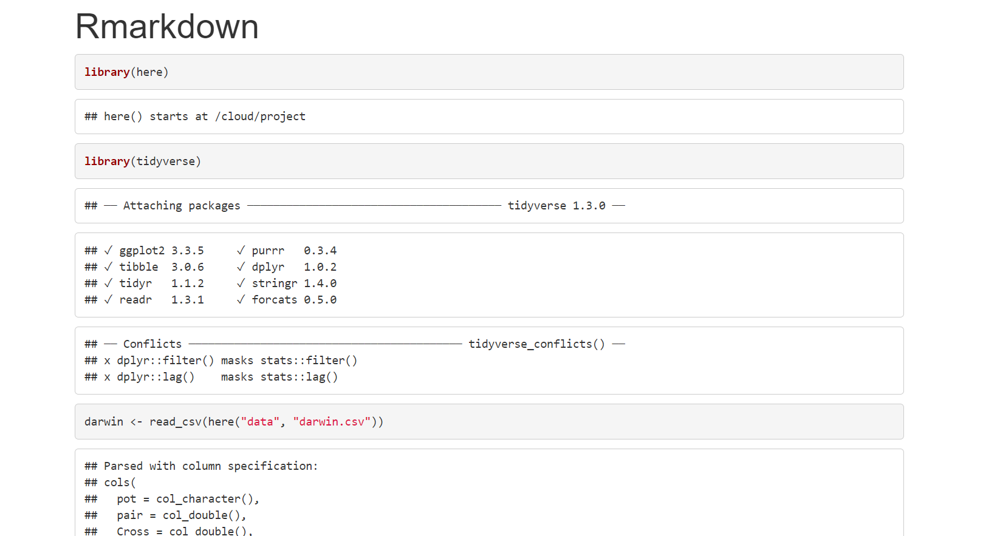

# Markdown

```{r, eval=TRUE, echo=FALSE, out.width="100%"}
knitr::include_graphics("images/rmarkdownoutputformats.png")
```

R Markdown is a widely-used tool for creating automated, reproducible, and share-worthy outputs, such as reports. It can generate static or interactive outputs, in Word, pdf, html, powerpoint, and other formats.

An R Markdown script combines R code and text such that the script actually becomes your output document. You can create an entire formatted document, including narrative text (can be dynamic to change based on your data), tables, figures, bullets/numbers, bibliographies, etc.

Documents produced with Rmarkdown, allow analyses to be included easily - and make the link between raw data, analysis & and a published report *completely reproducible*.

With Rmarkdown we can make reproducible html, word, pdf, powerpoints or websites and dashboards^[(https://rmarkdown.rstudio.com/lesson-9.html)]

**To make your Rmd publish - hit the knit button at the top of the doc**

### Format

* Go to RStudio Cloud and open **Week 5 - Rmarkdown**

* Follow the instructions carefully - and assemble your Rmarkdown file bit by bit - when prompted to 'knit' the document do it. We will then observed the results and might make changes.

## Background to Rmarkdown

* Markdown is a “language” that allows you to write a document using plain text, that can be converted to html and other formats. It is not specific to R. Files written in Markdown have a ‘.md’ extension.

* R Markdown: is a variation on markdown that is specific to R - it allows you to write a document using markdown to produce text and to embed R code and display their outputs. R Markdown files have ‘.Rmd’ extension.

* rmarkdown - the package: This is used by R to render the .Rmd file into the desired output. It’s focus is converting the markdown (text) syntax, so we also need…

* knitr: This R package will read the code chunks, execute it, and ‘knit’ it back into the document. This is how tables and graphs are included alongside the text.

* Pandoc: Finally, pandoc actually convert the output into word/pdf/powerpoint etc. It is a software separate from R but is installed automatically with RStudio.

Most of this process happens in the background (you do not need to know all these steps!) and it involves feeding the .Rmd file to knitr, which executes the R code chunks and creates a new .md (markdown) file which includes the R code and its rendered output. The .md file is then processed by pandoc to create the finished product: a Microsoft Word document, HTML file, powerpoint document, pdf, etc. 
When using RStudio Cloud - all of these features are pre-loaded - if you take your R journey further in the future and install a copy of R and RStudio on your own computer you might have to do a little setting up to get this working. 

```{r, eval=TRUE, echo=FALSE, out.width="80%"}
knitr::include_graphics("images/0_rmd.png")
```

## Starting a new Rmd file

In RStudio, if you open a new R markdown file, start with ‘File’, then ‘New file’ then ‘R markdown…’.

R Studio will give you some output options to pick from. In the example below we select “HTML” because we want to create an html document. The title and the author names are not important. If the output document type you want is not one of these, don’t worry - you can just pick any one and change it in the script later.

**For now open the markdown file which I have made in the Markdown sub-folder**. 

```{block, type="warning"}

The working directory for .rmd files is a little different to working with scripts. 

With a .Rmd file, the working directory is wherever the Rmd file itself is saved. 

For example if you have your .Rmd file in a subfolder ~/markdownfiles/markdown.Rmd the code for read_csv("data/data.csv") within the markdown will look for a .csv file in a subfolder called data *inside* the `markdownfiles    ` folder and not the root project folder where the .RProj file lives. 

So we have two options when using .Rmd files

1) Don't put the .Rmd file in a subfolder and make sure it lives in the same directory as your .RProj file

2) Use the `here` package to describe file locations - more later
```


## R Markdown parts

An R Markdown document can be edited in RStudio just like a standard R script. When you start a new R Markdown script, RStudio tries to be helpful by showing a template which explains the different section of an R Markdown script.

The below is what appears when starting a new Rmd script intended to produce an html output.

```{r, eval=TRUE, echo=FALSE, out.width="80%"}
knitr::include_graphics("images/templatermd.png")
```

As you can see, there are three basic components to any Rmd file: YAML, Markdown text, and R code chunks.

```{r, eval=TRUE, echo=FALSE, out.width="100%"}
knitr::include_graphics("images/rmarkdown_translation.png")
```

### YAML

Referred to as the ‘YAML metadata’ or just ‘YAML’, this is at the top of the R Markdown document. This section of the script will tell your Rmd file **what type of output to produce**, formatting preferences, and other metadata such as document title, author, and date. 
In the example above, because we clicked that our default output would be an html file, we can see that the YAML says output: `html_document`. However we can also change this to say `powerpoint_presentation` or `word_document` or even `pdf_document`.

```{block, type="try"}
Can you edit the YAML in the Rmarkdown file in the markdown folder to have your name as author, today's date and the title of the file should be called "Darwin's Maize Plants". 

```

### Text

This is the narrative of your document, including the titles and headings. It is written in the “markdown” language, which is used across many different software.

Below are the core ways to write this text. See more extensive documentation available on R Markdown “cheatsheets” at the RStudio website^[(https://www.rstudio.com/resources/cheatsheets/)].

#### New lines

Uniquely in R Markdown, to initiate a new line, enter *two spaces** at the end of the previous line and then Enter/Return.

#### Text emphasis

Surround your normal text with these characters to change how it appears in the output.

Underscores (\_text\_) or single asterisk (\*text\*) to *italicise*

Double asterisks (\*\*text\*\*) for **bold** text

Back-ticks  (\`text\`) to display text as `code`

The actual appearance of the font can be set by using specific templates (specified in the YAML metadata).

#### Titles and headings

A hash symbol in a text portion of a R Markdown script creates a heading. This is different than in a chunk of R code in the script, in which a hash symbol is a mechanism to comment/annotate/de-activate, as in a normal R script.

Different heading levels are established with different numbers of hash symbols at the start of a new line. One hash symbol is a title or primary heading. Two hash symbols are a second-level heading. Third- and fourth-level headings can be made with successively more hash symbols.


```

# First-level heading / title

## Second level heading  

### Third-level heading

```

#### Bullets and numbering

Use asterisks (*) to created a bullets list. Finish the previous sentence, enter two spaces, Enter/Return twice, and then start your bullets. Include a space between the asterisk and your bullet text. After each bullet enter two spaces and then Enter/Return. Sub-bullets work the same way but are indented. Numbers work the same way but instead of an asterisk, write 1), 2), etc. Below is how your R Markdown script text might look.

Here are my bullets (there are two spaces after this colon):  

```
* Bullet 1 (followed by two spaces and Enter/Return)  
* Bullet 2 (followed by two spaces and Enter/Return)  
  * Sub-bullet 1 (followed by two spaces and Enter/Return)  
  * Sub-bullet 2 (followed by two spaces and Enter/Return)  
```

### Code Chunks

Sections of the script that are dedicated to running R code are called “chunks”. This is where you may load packages, import data, and perform the actual data management and visualisation. There may be many code chunks, so they can help you organize your R code into parts, perhaps interspersed with text. To note: These ‘chunks’ will appear to have a slightly different background colour from the narrative part of the document.

Each chunk is opened with a line that starts with three back-ticks, and curly brackets that contain parameters for the chunk ({ }). The chunk ends with three more back-ticks.

```{r, eval=TRUE, echo=FALSE, out.width="80%"}
knitr::include_graphics("images/chunk.png")
```

You can create a new chunk by typing it out yourself, by using the keyboard shortcut “Ctrl + Alt + i” (or Cmd + Shift + r in Mac), or by clicking the green ‘insert a new code chunk’ icon at the top of your script editor.

Some notes about the contents of the curly brackets { }:

They start with ‘r’ to indicate that the language name within the chunk is R

After the r you can optionally write a chunk “name” – these are not necessary but can help you organise your work. Note that if you name your chunks, you should ALWAYS use unique names or else R will *complain* when you try to render.

The curly brackets can include other options too, written as tag=value, such as:

* eval = FALSE to not run the R code

* echo = FALSE to not print the chunk’s R source code in the output document

* warning = FALSE to not print warnings produced by the R code

* message = FALSE to not print any messages produced by the R code

* include = either TRUE/FALSE whether to include chunk outputs (e.g. plots) in the document

* out.width = and out.height = - size of ouput e.g. out.width = "75%"

* fig.align = "center" adjust how a figure is aligned across the page

* fig.show='hold' if your chunk prints multiple figures and you want them printed next to each other (pair with out.width = c("33%", "67%").


A chunk header must be written in **one line**

Try to avoid periods, underscores, and spaces. Use hyphens ( - ) instead if you need a separator.

Read more extensively about the knitr options here^[(https://yihui.org/knitr/options/)].

There are also two arrows at the top right of each chunk, which are useful to run code within a chunk, or all code in prior chunks. Hover over them to see what they do.

### `here`

The package `here` @R-here and its function `here()` make it easy to tell R where to find and to save your files - in essence, it builds file paths.

This is how `here()` works within an R project:

- When the here package is first loaded within the R project, it places a small file called “.here” in the root folder of your R project as a “benchmark” or “anchor”

- In your scripts, to reference a file in the R project’s sub-folders, you use the function `here()` to build the file path in relation to that anchor

- To build the file path, write the names of folders beyond the root, within quotes, separated by commas, finally ending with the file name and file extension as shown below

- `here()` file paths can be used for both importing and exporting

So when you use `here()` wrapped inside other functions for importing/exporting (like `read_csv()` or `ggsave()`) if you include `here()` you can still use the RProject location as the root directory when 'knitting' Rmarkdown files, even if your markdown is tidied away into a separate markdown folder.

```{block, type="try"}

Can you take the code below and put it into an R code chunk?

Try your first "knit" to make a document. 

```

## Activity 1. Knit your first document

```{r, eval = FALSE}
library(here)
library(tidyverse)

darwin <- read_csv(here("data", "darwin.csv"))
darwin
```

```{r, eval=TRUE, echo=FALSE, out.width="120%"}

```

This has worked, but it looks quite messy, mostly because messages and warnings produced alongside our R functions are printed in the final document


## Activity 2. Can you edit the R chunk so that the code and any warnings/messages are invisible. But the code output is still printed?

Once you have made your edits to the [chunk options](@code-chunks) try hitting 'knit' again. 

### Global options

For global options to be applied to all chunks in the script, you can set this up within your very first R code chunk in the script. 
This is very handy if you know you will want the majority of your code chunks to behave in the same way.
For instance, so that only the outputs are shown for each code chunk and not the code itself, you can include this command in the R code chunk (and set this chunk to `include = false`):

```{r, eval = FALSE}
knitr::opts_chunk$set(echo = FALSE) 
```

### In-text code


You can also include minimal R code within back-ticks. Within the back-ticks, begin the code with “r” and a space, so RStudio knows to evaluate the code as R code. See the example below.

\` r Sys.Date()\`

When typed in-line within a section of what would otherwise be Markdown text, it knows to produce an r output instead: `r Sys.Date()`

The example above is simple (showing the current date), but using the same syntax you can display values produced by more complex R code (e.g. to calculate the min, median, max of a column). You can also integrate R objects or values that were created in R code chunks *earlier* in the script.

```{r, eval = FALSE}
average_height <- darwin %>% 
  summarise(mean_self=mean(Self),
            mean_cross=mean(Cross))

```

The average height of the self-crossed plants is \` r average_height [,1]\`cm while the outcrossed plants are \` r average_height [,2]\`cm, so on average the outcrossed plants are \` r average_height [,2]- average_height [,1]\`cm taller. 

```{block, type="try"}

Can you include the above code block and make sure it runs without the code being visible? 

Underneath include the text - it should produce the code outputs in the knitted doc. 

Try it!
```

## Static images

You can include images in your R Markdown in several ways:

knitr::include_graphics("path/to/image.png")

```{r, eval = F}
knitr::include_graphics("../data/images/darwin.png")
# ../ is necessary here because in order to organise the file path starting in the markdown folder, directing it to go UP to the parent folder then down through data/images
```

Alternatively we could use the `here()` function - which means it doesn't matter where our markdown file 'lives'. 

knitr::include_graphics(here::here("path", "to", "image.png"))

```{r, eval = F}
knitr::include_graphics(here("data", "images", "darwin.png"))

```

```{block, type="rmdquestion"}
Can you get your document to knit with this new image included?
```


## ggplot

https://benjaminlouis-stat.fr/en/blog/2020-05-21-astuces-ggplot-rmarkdown/

## Tables

To create and manage able objects, we first pass the data frame through the `kable()` function. The package `kableExtra` @R-kableExtra gives us lots of extra styling options.^[(https://cran.r-project.org/web/packages/kableExtra/vignettes/awesome_table_in_html.html)]

```{block, type="try"}
Can you get this working?
Add the library call for `kableExtra` to the first chunk of your Rmd file, then make a chunk for the below at the bottom of your file and hit knit to test.
```

```{r, eval = F}
darwin %>% 
  summarise(mean_self=mean(Self),
            mean_cross=mean(Cross)) %>% 
  kbl(caption="Table 1. example table caption") %>% 
  kable_styling(bootstrap_options = "striped", full_width = F, position = "left")

```


## Self-contained documents

For a relatively simple report, you may elect to organize your R Markdown script such that it is “self-contained” and does not involve any external scripts.

Everything you need to run the R markdown is imported or created within the Rmd file, including all the code chunks and package loading. This “self-contained” approach is appropriate when you do not need to do much data processing (e.g. it brings in a clean or semi-clean data file) and the rendering of the R Markdown will not take too long.

In this scenario, one logical organization of the R Markdown script might be:

* Set global knitr options

* Load packages

* Import data

* Process data

* Produce outputs (tables, plots, etc.)

* Save outputs, *if applicable* (.csv, .png, etc.)

## Source files

One variation of the “self-contained” approach is to have R Markdown code chunks “source” (run) other R scripts. 

This can make your R Markdown script less cluttered, more simple, and easier to organize. It can also help if you want to display final figures at the beginning of the report. 

In this approach, the final R Markdown script simply combines pre-processed outputs into a document.

```
source(here("scripts", "your-script.R"))
```

```{block, type="try"}

Can you try it for yourself? There is a pre-written script in your R project, just use the source command to read in this script - then you can call objects made externally - in this case a penguin plot - put the code block in and hit knit.

```

```{r, eval = F}
source(here("scripts", "penguin script.R"))
scat ### object generated in penguin script
```


## Activity 3: Test yourself
### Head to Blackboard when complete and submit your document.

The data found in "darwin.csv" was originally collected by Charles Darwin and published in *The effects of cross and self-fertilisation in the vegetable kingdom*, in 1876. In this publication he described how he produced seeds of *Zea mays* (maize) that were fertilised with pollen from the same individual (inbreeding) or by crossing to a different plant (outbreeding). Pairs of seeds were then taken from self-fertilised and crossed plants and germinated in pots, and the height of the young seedlings measured as a proxy for their fitness. Darwin wanted to know whether inbreeding reduced their fitness. 

```{block, type="try"}

Can you make your first reproducible document?

```

* Write a short background on this subject 250-300 words on the data and the experimental hypothesis (use some of the information above)

* Write a results section on this data including:

    * A figure of the individual data points
    
    * A summary results table with the mean and s.d. for the plants
    
    * Write a summary of the results where the figures and table are referenced but you *must* describe the results too. e.g. 
    
    
"Results are shown in Figure 1" is **not ok**

But *in your own words* describe the direction and effect size of any differences and then refer to Figures and tables

"The mean height of self-crossed plants is *x* and the mean height of crossed plants is *y*, meaning on average self-crossed plants are... which may indicate that ... (Figure 1, Table 1)"

    
* knit your rmarkdown as a **pdf** and submit to Blackboard. 

```{block, type="info"}

Remember your code blocks MUST be in the right order!!!

```

## Summing up Rmarkdown

### What we learned

You have learned

* How to use markdown

* How to embed R chunks, to produce code, figures and analyses

* How to organise projects with `here`

* How to knit to pdf and html outputs

* How to make simple tables

You have used

* `knitr` as part of Rmarkdown

* `kableExtra` @R-kableExtra

* `here` @R-here


### Further Reading, Guides and tips

* [R Cheat Sheets](https://www.rstudio.com/resources/cheatsheets/)

* @xie2015 Dynamic documents with Rmarkdown

*The fully comprehensive guide*

(https://rmarkdown.rstudio.com/articles_intro.html)

(https://rmarkdown.rstudio.com/authoring_quick_tour.html)


