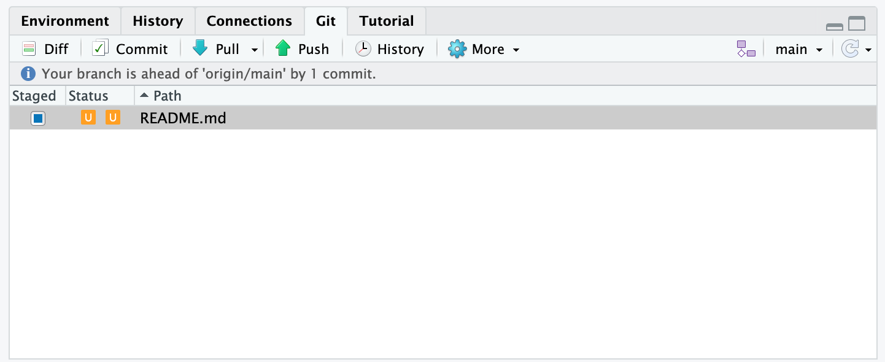
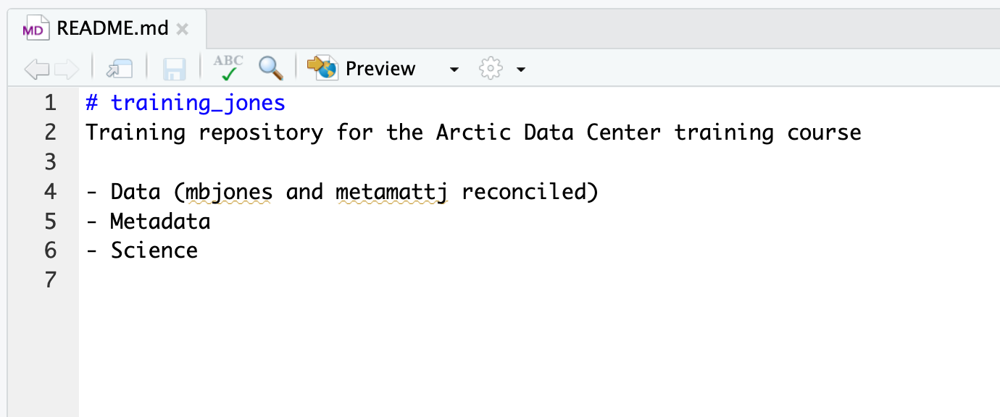

# Github

## Let's Git it started 

Git is a **version control system**. Originally built to help groups of developers work collaboratively on big software projects. It helps us manage our RStudio projects - with tracked changes. 

Git and GitHub are a big part of the data science community. We can use GitHub in a number of ways

1) To source code and repurpose analyses built by others for our own uses

2) Manage our analysis projects so that all parts of it: 

    🔢 Data
  
    ✍ ️Scripts
  
    📊 Figures
  
    📝 Reports
  
Are version controlled and open access

3) Version control lets you recover from any mistakes & your analysis is *backed up* externally

4) When you come to publish any reports - your analysis is accessible to others

5) Build up your own library of projects to show what you can do in Data Science


### What is Github?

Watch this video *before* or *after* today's session:

<iframe width="560" height="315" src="https://www.youtube.com/embed/w3jLJU7DT5E" title="YouTube video player" frameborder="0" allow="accelerometer; autoplay; clipboard-write; encrypted-media; gyroscope; picture-in-picture" allowfullscreen></iframe>

### Will this be fun?

No.

Using GitHub and version control is a bit like cleaning your teeth. It's not exactly fun, but it's good for you and it promotes excellent hygiene. It also only takes about two minutes. 

When we talk a about projects on GitHub we refer to Repositories / repos.

Repos on GitHub are the same unit as an RStudio Project - it's a place where you can easily store all information/data/etc. related to whatever project you're working on.

The way in which we will set up our RStudio Projects will now have a few extra steps to it

1) Make a new GitHub repository (or *fork* an existing one)

2) Make a New project on RStudio Cloud - selecting the *from GitHub Repository* option 

3) Clone your GitHub repo into an RStudio Project

4) Make sure RStudio and Github can *talk* to each other

5) Go about your normal business:

  * When it comes to *saving* your files, you will also periodically make a **commit** - this takes a multi-file *snapshot* of your *entire* project

  * At the end of a session **push** your changes to GitHub.

These changes to working with RStudio will feel a little different at first, but will quickly become routine - and are a big step forward in your Data Science skills. 

### The Payoff

* **A portfolio:** build up a library of data science projects you can show off

* **be keen:** track the development of R packages on GitHUb

* **version control:** keep a safe archive of all your edits and changes

* **play with others:** easy ways to collaborate on data science projects

For the full rundown on how to use Git and R you can't go wrong with checking out [Happy Git](https://happygitwithr.com/)


## Set up GitHub

First things first you will need to set yourself up with a GitHub account. 

Head to [GitHub](https://github.com/) and sign up for a free account. 

```{block, type="warning"}
Make a careful note of

* The username you choose

* Use the same email you have signed up to RStudio Cloud with

* Note your password carefully! 

```


## **Activity 1:** Fork & clone an existing repo on GitHub, make edits, push back

**a.** Go to [github.com](https://github.com/) and log in (you need your own account - for sign up with your uea.ac.uk e-mail)

**b.** In the Search bar, look for repo **Philip-Leftwich/5023Y-Happy-Git**

**c.** Click on the repo name, and look at the existing repo structure

**d.** **FORK** the repo

### What the hell is a fork?

```{r fork, echo=FALSE, eval=TRUE}
knitr::include_graphics("images/fork.png")
```


A fork is when you generate a *personal* copy of another user's [repository](#glossary-github).

**e.** Press Clone/download and copy the URL, then create a **new** project in RStudio Cloud selecting the **New project from Git repository** option -  make sure you are in the 5023Y Workspace

```{r , echo=FALSE, eval=TRUE}
knitr::include_graphics("images/new-project.png")
```


**f.** Open the some_cool_animals.Rmd document, and the accompanying html 

**g.** Add *your name* to the top of the document

**h.** BUT WAIT. We have forgotten to add a great image and facts about a very important species - Baby Yoda, including an image (the file is in the repo, and the info to add is below).


**FACTS**

```{r grogu, echo=FALSE, eval=TRUE}
knitr::include_graphics("images/Grogu.png")
```


- Also known as "The Child"

- likes unfertilised frog eggs & control knobs

- strong with the force

<p>&nbsp;</p>
<p>&nbsp;</p>


**i.** Once you’ve added Grogu, knit the Rmd document to update the html

**j.** Add your Git credentials go to section [talking to github](#talking-to-github)

**k.** Stage, Commit & Push all files [(glossary)](#glossary-github)

Staged - pick those files which you intend to bind to a commit

Commit - write a short descriptive message, binds changes to a single [commit](#commit)

Push - "Pushes" your changes from the local repo to the remote repo on GitHub, [(push)](#push)


**l.** On GitHub, refresh and see that files are updated. Cool! Now you’ve used something someone else has created, customized it, and saved your updated version. 

## Talking to GitHub

Getting set up to talk to GitHub can seem like a pain. Eventually when you work on your own computer - with a copy of R & RStudio installed - you will only have to do this once. For now when we use RStudio Cloud - it looks like we have to do this **once per project**. It only takes a few seconds and you should put these commands **directly into your console**. 

Run this first line **in your console** and put in your GitHub username and the e-mail connected to your GitHub account. 

```{block, type = "warning"}
Make sure you go to your 
RStudio Cloud profile > Authentication and select Github Enabled & Private repo access also enabled
```

```{r, eval = F}
usethis::use_git_config(user.name = "Jane Doe", user.email = "jane@example.org")
```


Then you need to give RStudio Cloud your GitHub Personal Access Token, which you can retrieve by going to Github.com and finding Settings > Developer Settings > Generate Token 

Select all the "scopes" and name your token. 

```{r, echo=FALSE, eval=TRUE}
knitr::include_graphics("images/git-PAT.png")
```

Make a note of this because you will need it whenever you set up a new project you want to talk to GitHub. GitHub recently removed password authentication in favour of PATs, but RStudio Cloud doesn't seem to have updated this yet - that's ok though - just enter this line of code - then copy+paste your PAT when prompted. - Option set/replace these credentials.

```{r, eval = F}
gitcreds::gitcreds_set()
```

```{block, type = "info"}

When you start working on your own computer, you should only have to re-input your PAT when it expires. On RStudio Cloud it works a little differently. 

In theory you should only need to input your PAT once per project. Sometimes it seems to forget and asks for it again between one session and the next. So you might want to write it down somewhere. 

If you forget your PAT - that's ok - you can't retrieve it - but you can just generate a new one o Github. 
```

### See changes

The first and most immediate benefit of using GitHub with your RStudio Project is seeing the changes you have made since your last commit.

The RStudio Git pane lists every file that’s been added, modified or deleted. The icon describes the change:

* You've changed a file
```{r , echo=FALSE, eval=TRUE, out.width = "5%", fig.align = 'left'}
knitr::include_graphics("images/git-modified.png") 
```

* You've added a new file Git hasn't seen before
```{r , echo=FALSE, eval=TRUE, out.width = "5%", fig.align = 'left'}
knitr::include_graphics("images/git-unknown.png")
```

* You've deleted a file
```{r , echo=FALSE, eval=TRUE, out.width = "5%", fig.align = 'left'}
knitr::include_graphics("images/git-deleted.png")
```

You can get more details on the changes that have been made to each file by right-clicking and selecting diff 

```{r, echo=FALSE, eval=TRUE, out.width = "15%", fig.align = 'left'}
knitr::include_graphics("images/git-diff.png")
```

This opens a new window highlighting the **diff**erences between your current file and the previous commit. 

```{r , echo=FALSE, eval=TRUE}
knitr::include_graphics("images/git-diff-window.png")
```
The background colours tells you whether the text has been added (green) or removed (red). (If you’re colourblind you can use the line numbers in the two columns at the far left as a guide). 


## How to use version control - when to commit, push and pull
 
Repositories (repos) on GitHub are the same unit as an RStudio Project - it's a place where you can easily store all information/data/etc. related to whatever project you're working on.
 
When we create a Repository in GitHub and have it communicating with a Project in RStudio, then we can changes moving in two directions

* **pull** information *from* GitHub *to* RStudio

or 

* **push** information *from* RStudio *to* GitHub where it is safely stored and/or our collaborators can access it. 

Github also keeps a *complete history* of different versions of each file that can be accessed/reviewed by you and your collaborators at any time, from anywhere, as long as you have the internet.

I have mentioned the term **commit** a few times (\@ref(glossary-github)). The fundamental unit of work in Git is a commit. A commit takes a snapshot of your code at a specified point in time. 

You create a commit in two stages:

1. You **stage** files, telling Git which changes should be included in the next commit.

2. You **commit** the staged files, describing the changes with a message.

### Stage 

```{block, type = "info"}
The staging section allows you to have finescale control over the files that are included with each commit. So in theory you could separate changes made in different files into different commitments. 

```

First **save** your files, then select files for inclusion by *staging* them, tick the checkbox and then select the commit box.

```{r , echo=FALSE, eval=TRUE}
knitr::include_graphics("images/stage_step_4.png")
```

A new window will open 'Review Changes' - and you will see the **diffs** in the bottom pane, and all the files you have selected for the latest commit. 

### Commit

In this new 'Review Changes' window you will see the list of files that were staged in the last window. 

If you click on a file name you see the changes that have been made highlighted in the bottom panel. Added content is highlighted in green, removed content is highlighted in red. 

To **commit** these changes (take a snapshot) you must enter a mandatory commit message in the "commit message" box. 


```{r , echo=FALSE, eval=TRUE, fig.cap = "Green = added content, Red = deleted content"}
knitr::include_graphics("images/stage_step_5.png")
```

The commit message should be short but meaningful (to you or any collaborators)

Describe the **why**, not the what. Git stores all the associated differences between commits, the message doesn’t need to say exactly what changed - this is kept track of for you by Git. Instead it should provide a summary that focuses on the **reasons** for the change. Make this understandable for someone else!

It is tradition to enter the very first message of a new project as "First Commit". 

Once you click > commit, a new window will open that summarises your commit - and you can close this

```{r , echo=FALSE, eval=TRUE}
knitr::include_graphics("images/stage_step_6.png")
```


```{block, type = "info"}

When you commit changes - you are not simply saving a new version of the file. It is committing the exact line changes made, and only modifying those files which you have selected for commit. 

```


### Push

At the moment, all of your commits are *local*, in order to send them to GitHub you have to select **Push** at this point your github credentials need to be in place - if you get prompted to provide these, close the windows and follow the steps [here](#talking-to-github) before trying again. 

Your git pane will be empty at this point - but there is a little message at the top detailing how many commits you are *ahead* of the master repo on GitHub. If this says your branch is one or more commits ahead of the master, then your commits are still local and haven't been pushed yet.

```{r , echo=FALSE, eval=TRUE}
knitr::include_graphics("images/stage_step_7.png")
```

To confirm the changes you made to the project have been pushed to Github, open your GitHub page (get the link in Tools > Project Options > Git/SVN). 

You should see all your files listed, alongside the file names you will see your last commit message *and* when you made the commit.

```{r , echo=FALSE, eval=TRUE}
knitr::include_graphics("images/git-link.png")
```

### A couple of general tips:

```{block, type="note"}

- Pull at the start of **every session** this retrieves the master repo from GitHub - which you update at the end of every session. This helps prevent *conflicts*

- **Commit/push** in small, meaningful increments and do this often. You can make **multiple** commits in a session - and **always push at the end of the session**

- In this way your GitHub Repo becomes the **master copy** of your project. 

```


## **Activity 2:** GitHub Classrooms enabled R Projects with subfolders

GitHub Classrooms is a way for me to set repos as assigments - when you accept an assignment on GitHub Classroom it *automatically* forks a private repo for you. 

You should make regular commits and pushes to save your work as you go - and I will be grading your project repositories on GitHub classrooms when you do your assignment work. 

```{block, type="warning"}
When you accept an assignment on GitHub classrooms - the repo won't appear on your main profile, this is because it belongs to our class rather than you. You can always find it by searching through your Organisations - **but** it's probably easiest just check the URL in Project Options on RStudio

```

**a.** Follow this [invite link](https://classroom.github.com/a/fM_53MuL)

**b.** You will be invited to sign-in to Github (if not already) & to join the UEABIO organisation

**c.** Clone your assignment to work locally in RStudio Cloud - 5023Y Workspace

**d.** In your local project folder, create subfolders ‘data’ and ‘figures’, 'scripts'.


**f.** Open a new `.R` script (or `.Rmd` if you prefer to practice with this)

**g.** Attach the `tidyverse`, `janitor`, and optionally `here` packages

**h.** Read in the infant_mortality.csv data

This is a file look at the death rate for every country in the world across six decades. See the README for more information

**i.** Stage, commit & push at this point - notice that the empty folder ‘final_graphs’ doesn’t show up (won’t commit an empty folder) - **you will have to set up your git credentials again**

**j.** Back in the script, write a short script to read and clean the data. 

This script is pre-written, it puts the data in tidy format, cleans names, makes sure year is treated as date data and filters four countries of interest.

Assign this to a new object 


```{r, eval = F}
library(tidyverse)
library(lubridate)
library(janitor)
library(plotly)

infant_mortality <- read_csv("data/infant_mortality.csv") 

subset_infant_mortality <- infant_mortality %>%
  pivot_longer(cols="1960":"2020", 
               names_to="year",               
               values_to="infant_mortality_rate") %>%
  mutate(year=lubridate::years(year)) %>% # set ymd format
  mutate(year=lubridate::year(year)) %>% # extract year
  janitor::clean_names() %>% # put names in snake case
  filter(country_name %in% 
           c("United States", 
             "Japan", 
             "Afghanistan", 
             "United Kingdom")) # extract four countries

# View(subset_infant_mortality)

# subset the date according to (US,UK, Japan = lowest infant death rates, Afghanistan = highest infant death rates)

```


**k.** Make a ggplot plotting the infant mortality rate by country

HINT - use `geom_line()` and remember to separate countries by colour

`r hide("Solution")`

```{r, eval = F}
ggplot(data = subset_infant_mortality) +
  geom_line(aes(x = year,
                 y = infant_mortality_rate,
                 color = country_name))

```

`r unhide()`

**l.** Update your graph with direct labels (using `annotate`) and vertical or horizontal lines with `geom_vline` or `geom_hline`. 

```{r, echo=FALSE, eval=TRUE, warning=FALSE, message=FALSE, fig.asp = 0.9, fig.width = 8}
# Graph
# New things: annotation + vertical line

library(tidyverse)
library(lubridate)
library(janitor)
library(here)

infant_mortality <- read_csv(here("book", "files", "infant_mortality.csv"))

subset_infant_mortality <- infant_mortality %>%
  pivot_longer(cols="1960":"2020", 
               names_to="year",               
               values_to="infant_mortality_rate") %>%
  mutate(year=lubridate::years(year)) %>% # set ymd format
  mutate(year=lubridate::year(year)) %>% # extract year
  janitor::clean_names() %>% # put names in snake case
  filter(country_name %in% 
           c("United States", 
             "Japan", 
             "Afghanistan", 
             "United Kingdom")) # extract four countries

ggplot(data = subset_infant_mortality,
                           aes(x = year,
                 y = infant_mortality_rate,
                 color = country_name)) +
  geom_line() +
  scale_color_manual(values = c("black", "blue", "magenta", "orange")) +
  annotate(geom = "text",
           x = 2023,
           y = 50,
           label = "Afghanistan",
           size = 4,
           colour="black") +
    annotate(geom = "text",
           x = 2023,
           y = -2,
           label = "Japan",
           size = 4,
           colour="blue") +
    annotate(geom = "text",
           x = 2023,
           y = 15,
           label = "United Kingdom",
           size = 4,
           colour="orange") +
    annotate(geom = "text",
           x = 2023,
           y = 5,
           label = "United States",
           size = 4,
           colour="magenta") +
  geom_vline(xintercept = 2000,
             lty = 2) +
  theme_minimal()+
  theme(legend.position="none")+
  xlim(1970, 2025)+
  labs(x="Year",
       y="Deaths per 100,000")+
  ggtitle("Mortality rate, infant (per 1,000 live births) \nhas been steadily falling in Afghanistan from 1970 to present")


```

`r hide("Solution")`

```{r, eval = F}
mortality_figure <- ggplot(data = subset_infant_mortality,
                           aes(x = year,
                 y = infant_mortality_rate,
                 color = country_name)) +
  geom_line() +
  scale_color_manual(values = c("black", "blue", "magenta", "orange")) +
  annotate(geom = "text",
           x = 2023,
           y = 50,
           label = "Afghanistan",
           size = 4,
           colour="black") +
    annotate(geom = "text",
           x = 2023,
           y = -2,
           label = "Japan",
           size = 4,
           colour="blue") +
    annotate(geom = "text",
           x = 2023,
           y = 15,
           label = "United Kingdom",
           size = 4,
           colour="orange") +
    annotate(geom = "text",
           x = 2023,
           y = 5,
           label = "United States",
           size = 4,
           colour="magenta") +
  geom_vline(xintercept = 2000,
             lty = 2) +
  theme_minimal()+
  theme(legend.position="none")+
  xlim(1970, 2025)+
  labs(x="Year",
       y="Deaths per 100,000")+
  ggtitle("Mortality rate, infant (per 1,000 live births) \nhas been steadily falling in Afghanistan from 1970 to present")

```

`r unhide()`

**m.** Use ggsave() to write your graph to a .png in the ‘final_graphs’ subfolder


```{r, eval = F}
ggsave("figures/infant mortality graph.png", plot = mortality_figure, dpi=900, width = 7, height = 7)
```

**n.** Save, stage, commit

**o** Let's do one more cool and fun thing! And make an interactive version of our plot using plotly @R-plotly just for fun!

```{r, eval = F}
ggplotly(mortality_figure, tooltip = c("infant_mortality_rate"))
## uses plotly package
```

**p** Now save, stage, commit & **push**

**q.** Check that changes are stored on GitHub


(**NOTE** this will be in your organisations rather than repos)

**Make sure you finish both exercises before next week to become a GitHub pro!!!!!!!!!**

## Find your classroom repos

When you work with GitHub classrooms your repos become part of our organisation UEABIO.

If you want to find your repos on GitHub then you can do this in a couple of ways

1) Bookmark the direct URL (if you noted it) from when you first visit the repo

2) Head to (https://github.com/UEABIO) - you should only be able to see repos that belong to **you**. 

3) From RStudio Cloud head to Tools > Project Options > Git to find the URL. 

```{r , echo=FALSE, eval=TRUE}
knitr::include_graphics("images/classroom-organisation.png")
```

## Git History

So far we have used Git to track, stage and commit our file changes to GitHub. Now we will look briefly at how to review our changes and what to do if we want to revert any changes.

### Commit History

To view your commit history in RStudio, simply click on the 'History' button 🕒 in the Git Panel.

This window is split in two parts. The top pane lists every commit you have made in this repository, with their associated messsages (top to bottom, most recent to last). 

Click on any commit and the bottom pane shows you the changes you made compared to the previous commit, there is also a summary of who made the commit, the commit message and the date it was made. 

There is also an SHA (Secure Hash Algorithm), this is a unique identifier for the commit, and Parent SHA which identifies the commit that immediately preceded it. 

You **can** also review your commit history on Github by clicking on the 'commits' link in the repository

### Reverting changes

One of the most powerful things about Git is the ability to revert to previous versions of files, if you made a mistake, broke something, or just changed your mind! 

How you do this depends on what stage you are at in making your changes. We'll go through each of these scenarios in turn.

#### Changes saved but not staged, committed or pushed

If you have saved changes to your file, but not yet staged them, you can click on the offending file in the Git pane and select 'revert'. This will roll back the file  to your last 'commit' (warning reverting cannot be undone).

Changes can be made to *part* of a file by opening the 'Diff' window. Select the line you wish to discard by double-clicking the line and select 'Discard line/chunk'

#### Staged but not committed

Simply unclick the staged check box, then revert as described above.

#### Staged and committed but not pushed

If you made a mistake or forgot to include a file in your last commit, you can fix your mistake, save the changes and tick the box 'Amend previous commit' in the 'Review Changes' pane.

If you want to make a change that was several commits ago there are two options:

* **Option 1** - easier but not *very Git* 🤷

Look in your commit history in RStudio - find the commit you want to go back to and click the 'View file @' button to show file contents.

Copy the contents of the file to clipboard and paste into your current file. Save, stage, commit as normal.

* **Option 2** - Go to Git history, find the commit and write down the SHA. 

Now go to the **Terminal** tab (next to Console) and type

```
git checkout <SHA> <filename>
```

This might look something like this

```
git checkout 2b4693d1 first_doc.Rmd
```

This command will copy the selected file from the past and replace it in the present. You may be asked if you want to reload the file now (say yes). Then stage, commit as usual. 

#### Staged, committed and pushed

You could use either of the strategies described above, although if you are using the Terminal there is now a better command `git revert`. 

First you need to identify the SHA of the commit you want to revert to as before. Then use the `git revert` command in the Terminal. Adding the `--no-commit` option stops us having to deal with intermediate commits. Adding `..HEAD` tells GIT to make this old commit the new/old "HEAD" or lead of the project. 

```
git revert --no-commit d27e79f1..HEAD

```

## Collaborate with Git

GitHub is great for collaboration. It can seem a little scary or complicated at first, but it's totally worth it! 

Github works as a *distributed system* this means each person working on a project has their own copy. Changes are then merged together in the remote repository on GitHub. 

For small projects we can use exactly the same system as above. Everybody connects their local repository to the same remote one. 

* **Pull** the repository at the start of *each* session to make sure you are working on the most up to-date version.

* Work on your aspect of the project, staging, committing and pushing as you go. 

For small projects this works well if each person has their own files to work on, but if two people are working on the same file *at the same time* this can cause a 'merge conflict'. So for bigger projects each collaborator creates a copy (fork) of the repository, then a **pull request** must be sent to the owner of the main repository to incorporate any changes, this includes a review step before these changes are integrated. 

## Final Git tips

Reminders:

* Commit often, and push at the end of a session

* If you don't want to track a file in your repository (maybe you aren't working with that in a collaboration) you can get Git to ignore by right-click and selecting Ignore. 

* Check the Github repo online to make sure changes are being pushed

* If it all goes wrong! And you trash your project! That's ok, as long as your GitHub repository online is good the final option is to delete your RStudio project on your computer or RStudio Cloud and clone the project from GitHub again! 

## Glossary-GitHub

```{r, eval=TRUE, echo=FALSE, warning=FALSE, message=FALSE}
library(tidyverse)
library(kableExtra)

text_tbl <- data.frame(
  Terms = c("clone", "commit","commit message" ,"fork","Git" ,"GitHub Classroom","Markdown","pull","push" ,"README","repository" ,"RMarkdown","personal access token"),
  Description = c("A clone is a copy of a repository that lives on your computer instead of on a website's server somewhere, or the act of making that copy. When you make a clone, you can edit the files in your preferred editor and use Git to keep track of your changes without having to be online. The repository you cloned is still connected to the remote version so that you can push your local changes to the remote to keep them synced when you're online.",
                  "A commit, or revision, is an individual change to a file (or set of files). When you make a commit to save your work, Git creates a unique ID that allows you to keep record of the specific changes committed along with who made them and when. Commits usually contain a commit message which is a brief description of what changes were made.","Short, descriptive text that accompanies a commit and communicates the change the commit is introducing.",
                  "A fork is a personal copy of another user's repository that lives on your account. Forks allow you to freely make changes to a project without affecting the original upstream repository. You can also open a pull request in the upstream repository and keep your fork synced with the latest changes since both repositories are still connected.",
                  "Git is an open source program for tracking changes in text files. It was written by the author of the Linux operating system, and is the core technology that GitHub, the social and user interface, is built on top of.",
                  "GitHub Classroom automates repository creation and access control, making it easy to distribute starter code and collect assignments on GitHub",
                  "Markdown is an incredibly simple semantic file format, not too dissimilar from .doc, .rtf and .txt. Markdown makes it easy for even those without a web-publishing background to write prose (including with links, lists, bullets, etc.) and have it displayed like a website.",
                  "Pull refers to when you are fetching in changes and merging them. For instance, if someone has edited the remote file you're both working on, you'll want to pull in those changes to your local copy so that it's up to date",
                  "To push means to send your committed changes to a remote repository on GitHub.com. For instance, if you change something locally, you can push those changes so that others may access them.",
                  "A text file containing information about the files in a repository that is typically the first file a visitor to your repository will see. A README file, along with a repository license, contribution guidelines, and a code of conduct, helps you share expectations and manage contributions to your project.",
                  "A repository (repo) is the most basic element of GitHub. They're easiest to imagine as a project's folder. A repository contains all of the project files (including documentation), and stores each file's revision history. Repositories can have multiple collaborators and can be either public or private.",
                  "Rmarkdown is a package and filetype that are deeply embedded with RStudio to allow the integration of Markdown and output chunks of programming code (such as R) to publish a variety of different file types",
                  "A token that is used in place of a password when performing Git operations over HTTPS. Also called a PAT.")
)

text_tbl %>% 
    kbl() 
  

```


## Summing up GitHub

### What we learned

You have learned:

* How to fork and clone GitHub Projects

* How to use GitHub classrooms

* How to make RStudio and GitHub talk to each other

* How to use version control, with stage, commit and push

* Remember to bookmark [Happy Git](https://happygitwithr.com/)

You have used

* `gitcreds` @R-gitcreds

* `usethis` @R-usethis


## Sharing a Github repo - Dealing with conflict when collaborating


### How to avoid a conflict

The best and simplest way to avoid Github conflicts is to follow some simple guidelines. If two people are sharing a repo and commit their work usually this will go smoothly. However, if you try to merge changes on the same part of the same file you will get a merge conflict. 

```
git merge issue-5
# Auto-merging index.html
# CONFLICT (content): Merge conflict in index.html
# Automatic merge failed; fix conflicts and then commit the result.

```

If you see a message like this, the first thing is **do not panic**. Merge conflicts can be easily fixed.

We can avoid merge conflicts altogether by following some simple organisation tips: 

1. Partition the project, work on independent R scripts, so that changes made by one person have no affect on the files someone else is working on.

2. Communicate - organise times when one person might work on a shared file, so that two people don't work on the same file at the same time

3. Always Pull the latest version of the repo *before* you start working, try pulling **just before you push** in order to collect the latest changes & **always** push to Github at the *end* of a session.


### Dealing with a conflict

Let's imagine you HAVE made a mistake and two people have tried to push changes for the same file at the same time! 

The *second* person trying to push a change to Github will get an error

```{r , echo=FALSE, eval=TRUE, fig.cap = "Git conflict"}
knitr::include_graphics("images/git-conflict-01-push-error.png")
```

Do what the message says and pull the changes from Github, this will generate a **different** error mesage. In this case indicating a merge conflict because of the differences on the same line of a file. In the Git pane, the file will now be flagged with an orange 'U'. This stands for 'unresolved'

```{r , echo=FALSE, eval=TRUE, fig.cap = "git conflict"}

```

To resolve the conflict, this file now needs to be edited. Git has flagged the locations in which conflicts have occurred with `<<<<<<<`, `=======` and `>>>>>>>`. The file needs to be edited merging the appropriate changes until the file reads how it should and all conflict markers are removed. 

```{r , echo=FALSE, eval=TRUE}
knitr::include_graphics("images/git-conflict-04-conflict-tags.png")
```

```{r , echo=FALSE, eval=TRUE}

```

### Commit resolutions

Proceed as normal, commit the file changes, this should change the file from orange `U` to blue `M` and push this to Github, all collaborators will need to be informed to Pull the updated repo to get the new changes. 

### Try and create and solve a merge error. 

```{block, type = "try"}

Merge Conflict Challenge
As part of your group why not try and intentionally create a merge conflict, and then go through the steps needed to resolve the issues and continue developing with the merged files. See the sections above for help with each of these steps:

Step 0: Ensure you have the same starting project
Step 1: Project co-ordinator makes a change and commits - a small change to the README.md
Step 2: Collaborator makes a change and commits on the same line
Step 3: Collaborator pushes the file to GitHub
Step 4: Owner pushes their changes and gets an error
Step 5: Owner pulls from GitHub to get Collaborator changes
Step 6: Owner edits the file to resolve the conflict
Step 7: Owner commits the resolved changes
Step 8: Owner pushes the resolved changes to GitHub
Step 9: Collaborator pulls the resolved changes from GitHub
Step 10: Both can view commit history

```


### Abort! 

Sometimes you just made a mistake. When you get a merge conflict, the repository is placed in a ‘Merging’ state until you resolve it. There’s a commandline command to abort doing the merge altogether:

In the terminal type

```
git merge --abort
```

Of course, after doing that you still haven’t synced with your collaborator’s changes, so things are still unresolved. But at least your repository is now usable on your local machine. Let me know asap and we can fix the issue

