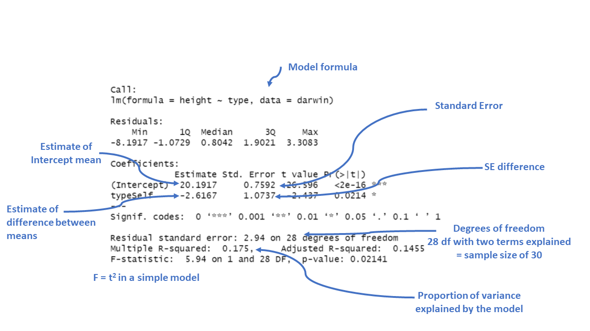

# Introduction to Linear Models


```{r, child='_setup.Rmd'}

```

In the last chapter we conducted a simple analysis of Darwin's maize data using R. We worked out confidence intervals 'by hand'. This simple method allowed us to learn more about analysis, estimates, standard error and confidence. But it is also slow, and it relied on the assumptions of a *z-distribution* to assess true differences between the groups. 

We will now work through a much more efficient way to carry out comparisons, we will use the functions in R that let us perform a **linear model** analysis.

### Packages

```{r}
library(tidyverse)
library(GGally)
library(emmeans)
library(performance)
```

```{r, eval=TRUE, echo=FALSE}

library(tidyverse)

library(here)

darwin <- read_csv(here("book", "files", "darwin.csv"))

```

## A linear model analysis for comparing groups

R has a general function `lm()` for fitting linear models, this is part of base R (does not require the tidyverse packages). We will run through a few different iterations of the linear model increasing in complexity. We will often want to fit several models to our data, so a common way to work is to fit a model and assign it to a named R object, so that we can extract data from when we need it. 

In the example below I have called the model `lsmodel0`, short for "least-squares model 0", this is because the linear-model uses a technique called **least-squares** we will explore what this means later. 

```{r}
lsmodel0 <- lm(formula = height ~ 1, data = darwin)

```

```{block, type = "try"}
You can pipe into the lm() function, but when we use functions that are "outside" of the tidyverse family we need to put a `.` where the data should go (as it is usually not the first argument).

lsmodel0 <- darwin %>% 
             lm(height ~ 1, data= .)


```


The first argument of the `lm()` function is formula (we won't write this out in full in the future) - and this specifies we want to analyse a **response** variable (height) as a function of an **explanatory** variable using the *tilde* symbol (~).

The simplest possible model ignores any explanatory variables, instead the `1` indicates we just want to estimate an intercept. Without explanatory variables this means the formula will just estimate the overall mean height of **all** the plants in the dataset.


## Summaries for models

When you have made a linear model, we can investigate a summary of the model using the base R function `summary()`. There is also a tidyverse option provided by the package `broom`(@R-broom).

### Broom

broom summarizes key information about models in tidy `tibble()s`. broom provides three verbs to make it convenient to interact with model objects:

* `broom::tidy()` summarizes information about model components

* `broom::glance()` reports information about the entire model

* `broom::augment()` adds informations about individual observations to a dataset and it can be used to model predictions onto a new dataset.

### Model summary

```{solution, multCode = T}

``{r}

summary(lsmodel0)

``

####

``{r}

broom::tidy(lsmodel0)

``

```


The output above is called the *table of coefficients*. The 18.9 is the *estimate of the model coefficient* (in this case it is the overall mean), together with its standard error. The first row in any R model output is always labelled the 'Intercept' and the challenge is usually to workout what that represents. In this case we can prove that this is the same as the overall mean as follows:

```{r}
mean(darwin$height)
```


This simple model allows us to understand what the `lm()` function does. 

### Compare means

What we really want is a linear model that analyses the *difference* in average plant height as a function of pollination type. We can use the `lm()` function to fit this as a linear model as follows:

```{r}
lsmodel1 <- lm(height ~ type, data=darwin)

# note that the following is identical

# lsmodel1 <- lm(height ~ 1 + type, data=darwin)
```

Now the model formula contains the pollination type in addition to an intercept.

```{r}
broom::tidy(lsmodel1)
```


Some things to notice about the above:

1) The intercept value has changed! So what does it represent now?

2) The label of the second row is 'typeSelf'

But what does this mean? Think about it and see if you can figure it out for yourself before clicking the reveal

```{solution}

The label of the second row 'typeSelf' is produced by combining the variable type, with one of the factors (Self). As there are only two levels in type, it stands to reason that the intercept must represent typeCross. So the coefficient in the label intercept is the average height of the 15 maize plants in the crossed treatment.

So what about the second row? A common mistake is to think that this must refer to the height of the Self plants. However, this cannot be true as the value is *negative*. Instead what it actually refers to is the **difference in the mean height of the two groups**. This focuses then on the question which we are asking: is their a difference in the height of plants that result from cross pollination when compared to plants that have been self pollinated? 

This linear model indicates the average height of Crossed plants is 20.2 inches, and Selfed plants are an average of 2.6 inches *shorter*.

You can confirm this for yourself: 

  
``{r}
darwin %>% 
  group_by(type) %>% 
  summarise(mean=mean(height))
``

```


Let's take a look at a fuller summary of our model, to see what else we can determine

```{r}

summary(lsmodel1)

```

```{r, eval=TRUE, echo=FALSE, out.width="80%", fig.cap = "Annotation of the summary function output"}

```

We could use the information from this model to superimpose the calculated means onto a plot. 

```{r, warning=FALSE, message=FALSE, eval=TRUE}
darwin %>% 
  ggplot(aes(x=type, 
             y=height,
             colour=type))+
  geom_jitter(alpha=0.5,
              width=0.1)+
  stat_summary(fun=mean,
               size=1.2)+
  theme_bw()
```

### Standard error of the difference

The output of the model also gives the standard errors of the values (estimates). In the first row the intercept calculates a mean and the standard error of the mean (SEM). As the second row gives the mean *difference* in this column it gives the *standard error of the difference* between the two means (SED). We have already seen how to calculate SEM, but what about SED?

$$
SED = {\sqrt \frac{s_1^2}{n_1}}+\frac{s_2^2}{n_2}
$$

> ** Note - The subscripts 1 and 2 indicate the two groups (self and cross). 

```{block, type = "info"}
Our linear model analysis doesn't actually calculate the individual variances for the two groups. Instead it uses a 'pooled' variance approach. This assumes the variance is roughly equal across all groups, and allows us to take advantage of the larger sample size through 'pooling', to generate a more accurate SED. However, this does assume that variance is *roughly equal* in the two groups. In fact last week when we calculated standard deviation, we saw this was not the case. So we must check this assumption in our model (more on this later). 
```

## Confidence intervals

```{solution, multCode = T}

``{r}
confint(lsmodel1)
``

####

``{r}
broom::tidy(lsmodel1, conf.int=T)
``

```

Because this follows the same layout as the table of coefficients, the output intercept row gives a 95% CI for the height of the crossed plants and the second row gives a 95% interval for the *difference in height between crossed and selfed plants*. The lower and upper bounds are the 2.5% and 97.5% of a *t*-distribution (more on this later). 

It is this difference in height in which we are specifically interested. Our summary models have generated *p*-values but we have conspicuously ignored these for now. Instead we are going to continue to focus on using confidence intervals to answer our question. 

## Answering the question

Darwin's original hypothesis was that self-pollination would reduce fitness (using height as a proxy for this). The null hypothesis is that there is no effect of pollination type, and therefore no difference in the average heights. 
We must ask ourselves if our experiment is consistent with this null hypothesis or can we reject it? If we choose to reject the null hypothesis, with what level of confidence can we do so?

To do this, we can simply whether or not the predicted value of our null hypothesis (a  difference of zero) lies inside the 95% CI for the difference of the mean. 

If our confidence intervals contain zero (or no difference), then we cannot establish a difference between our sample difference in height (-2.62 inches) from the null prediction of zero difference, given the level of variability (noise) in our data. 

In this case we can see that the upper and lower bounds of the confidence intervals do not cross zero. The difference in height is consistent with Darwin's alternate hypothesis of inbreeding depression. 

The `GGally` package has a handy `ggcoef_model()` function, that produces a graph of the estimated mean difference with an approx 95% CI. As we can see we are able to reject the null hypothesis at a 95% confidence level. 

```{r, warning=FALSE, message=FALSE, eval=T}

GGally::ggcoef_model(lsmodel1,
                     show_p_values=FALSE, 
                     conf.level=0.95)

```

```{block, type = "try"}
Set the confidence levels to 99%, do you think the difference between treatments is still statistically significant at an \alpha of 0.01?
```

If we increase the level of confidence (from 95% to 99%, roughly 2 SE to 3 SE), then we may find that we cannot reject the null hypothesis at a higher threshold of confidence. Try altering the conf.level argument above for yourself to see this in action. 

We can also include this argument in the `tidy()` function if we wish to:

```{r}
broom::tidy(lsmodel1, conf.int=T, conf.level=0.99)
```

### Getting the other treatment mean and standard error

One limitation of the table of coefficients output is that it doesn't provide the mean and standard error of the *other* treatment level (only the difference between them). If we wish to calculate the "other" mean and SE then we can get R to do this.

```{r}
darwin %>% 
  mutate(type=factor(type)) %>% 
  mutate(type=fct_relevel(type, c("Self", "Cross"))) %>% 
  lm(height~type, data=.) %>% 
  broom::tidy()

```

After relevelling, the self treatment is now taken as the intercept, and we get the estimate for it's mean and standard error

### Emmeans

We could also use the package [`emmeans`](https://aosmith.rbind.io/2019/03/25/getting-started-with-emmeans/) and its function `emmeans()` to do a similar thing

```{r, eval=T}
means <- emmeans::emmeans(lsmodel1, specs = ~ type)

means

```

The advantage of emmeans is that it provides the mean, standard error and 95% confidence interval estimates of all levels from the model at once (e.g. it relevels the model multiple times behind the scenes). 


`emmeans` also gives us a handy summary to include in data visuals that combine raw data and statistical inferences. These are standard `ggplot()` outputs so can be [customised as much as you want](#intro-to-grammar).

```{r}

means %>% 
  as_tibble() %>% 
  ggplot(aes(x=type, 
             y=emmean))+
  geom_pointrange(aes(
    ymin=lower.CL, 
    ymax=upper.CL))

```

Notice that no matter how we calculate the estimated SE (and therefore the 95% CI) of both treatments is the same. This is because as mentioned earlier the variance is a pooled estimate, e.g. variance is not being calculate separately for each group. The only difference you should see in SE across treatments will be if there is a difference in *sample size* between groups. 

```{block, type = "info"}
Notice how the Confidence intervals of the estimated means strongly overlap, there is a difference between the two SEMs and the SED we have calculated. So overlapping error bars cannot be used to infer significance. 
```

Because of this pooled variance, there is an assumption that variance is equal across the groups, this and other assumptions of the linear model should be checked. We cannot trust our results if the assumptions of the model are not adequately met. 

## Assumption checking

So now we have been through the main parts of a linear model analysis, we have results and inferences. But we need to check whether the assumptions of the model are adequately met so that we know whether our analysis can be trusted. 

In this first part we are going to check two of our assumptions: 

1) that the residual/unexplained variance in our data is approximately *normally distributed*.

2) that the residual/unexplained variance is approximately *equal* between our groups

Residuals are the differences between the observed values and the fitted values produced by the model - in this case the heights of the plants against the treatment means. The assumption of a normal distribution applies because the linear model uses this to calculate the standard errors (and therefore confidence intervals). The assumption of equal variance applies because of this pooled variance approach (e.g. we have two treatments with 15 replicates - but by pooling the variance across treatments we have a sample size of 30).

Several functions exist to check assumptions of linear models, and the easiest way to do this is to make graphs. We can do this in several ways, in base R with the `plot()` function, and by using the `performance::check_model()` function. 

```{solution, multCode = T}
``{r}

performance::check_model(lsmodel1)

``

####

``{r}

plot(lsmodel1)

``

```

### Normal distribution

```{r, eval=T}
performance::check_model(lsmodel1, check=c("normality","qq"))
```

```{r}
plot(lsmodel1, which=c(2,2))
```

#### What is a Quantile-Quantile (QQ) plot?

A QQ plot is a classic way of checking whether a sample distribution is the same as another (or theoretical distribution). They look a bit odd at first, but they are actually fairly easy to understand, and very useful! The qqplot distributes your data on the y-axis, and a theoretical normal distribution on the x-axis. If the residuals follow a normal distribution, they should meet to produce a perfect diagonal line across the plot.

Watch this video to see [QQ plots explained](https://www.youtube.com/watch?v=okjYjClSjOg)

```{r, eval=TRUE, echo=FALSE, out.width="80%", fig.cap = "Examples of qqplots with different deviations from a normal distribution"}
knitr::include_graphics("images/qq_example.png")
```

In our example we can see that *most* of our residuals can be explained by a normal distribution, except at the extreme low end of our data. This is not surprising, as we already identified some potential outliers. 

So the fit is not perfect, but it is also not terrible! 

### Equal variance

```{r, eval=T}
performance::check_model(lsmodel1, check="homogeneity")
```

```{r}
plot(lsmodel1, which=c(1,3))
```

In order to assess if variances are equal we can plot the residuals (variance) of our data against the fitted (predicted) values. If the residuals were zero, this would mean there is no error, and our data exactly matches our estimates. In reality, there will always be residual error, but as long as it is evenly distributed between treatments this is ok. 

The `check_models` plot provides what we call 'standardized residuals' where we divide the residual error by the standard deviation. 

In this instance we can see that the higher fitted values (Cross treatment) appears to be more variable than the lower fitted values. Again, this is not too bad, but not perfect. This is probably being influence at least partially by the potential outliers. 

### Outliers

We have talked a lot about the potential effect of outliers, we can see that they are potentially affecting our estimates of error/variance. However, we should also check how much of an effect they might be having on the model estimates (means). This is where formal outlier tests are useful. 

```{r, eval=T}

performance::check_model(lsmodel1, check="outliers")

```


```{r}
plot(lsmodel1, which=c(4,4))
```

The value which the data points are being measured against is called Cook's distance. This is a measure of how much 'leverage' a single data point is exerting on the model, if it is too high, it may be having an outsized effect on the estimates. The `check_model()` function gives contours to indicate whether data points fall inside or outside the margins for affecting fit, but a rough estimate for an acceptable Cook's Distance is either $\frac{4}{N}$ or $\frac{4}{df}$, but you are unlikely to have to calculate this by hand. 


## Summary

So what can we determine from this analysis? Our model is not perfect, however it is reasonably good. However, we have not addressed an important part of our experimental design yet. The fact that the plants are paired, so in this example we have basically carried out a Student's t-test, not a paired t-test. Later we will add pair as another explanatory variable and see how this affects our model. 

So remember a linear model sets one factor level as the 'intercept' estimates its mean, then draws a line from the first treatment to the second treatment, the slope of the line is the difference in means between the two treatments. 

The difference in means is always accompanied by a standard error of the difference (SED), and this can be used to calculate a 95% confidence interval. If this confidence interval does not contain the intercept value, we can reject the null hypothesis that there is 'no effect'. 

Linear models make a variety of assumptions, including that the noise (residual differences) are approximately normally distributed, with roughly equal (homogenous) variance. 

```{r, eval=T}
darwin %>% 
  ggplot(aes(x=type, 
             y=height))+
   geom_jitter(width=0.1, 
              pch=21, 
              aes(fill=type))+
  theme_classic()+
  geom_segment(aes(x=1, xend=2, y=20.192, yend=20.192-2.617), linetype="dashed")+
stat_summary(fun.y=mean, geom="crossbar", width=0.2)

```

