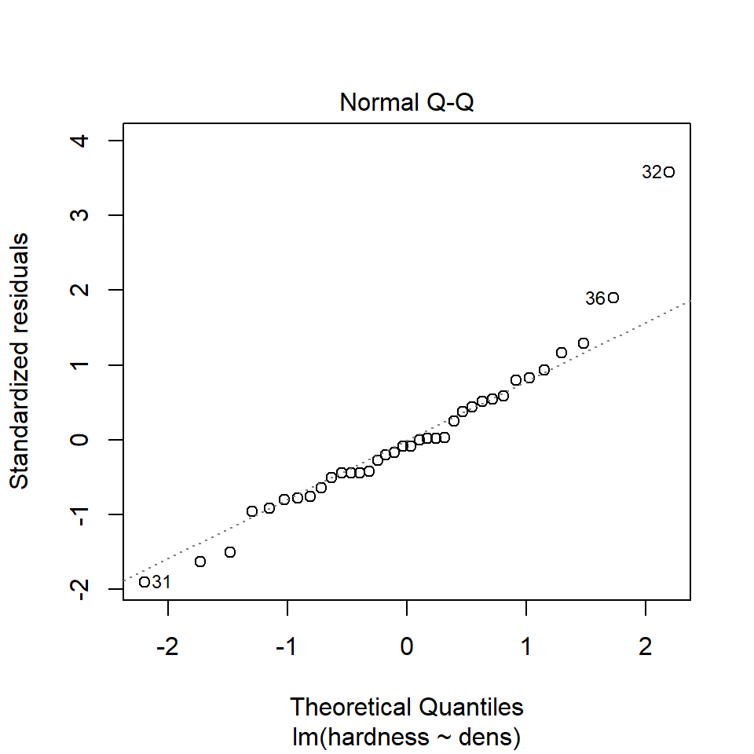

# Regression


## Introduction to Regression

So far we have used linear models for analyses between *two* 'categorical' explanatory variables e.g. *t*-tests. But what about when we have a 'continuous' explanatory variable? For that we need to use a regression analysis, luckily this is just another 'special case' of the linear model, so we can use the same `lm()` function we have already been using, and we can interpret the outputs in the same way. 


```r
library(tidyverse)
library(rstatix)
library(performance)
```

## Linear regression

Much like the *t*-test we have generating from our linear model, the regression analysis is interpreting the strength of the 'signal' (the change in mean values according to the explanatory variable), vs the amount of 'noise' (variance around the mean). 

We would normally visualise a regression analysis with a scatter plot, with the explanatory (predictor, independent) variable on the x-axis and the response (dependent) variable on the y-axis. Individual data points are plotted, and we attempt to draw a straight-line relationship throught the cloud of data points. This line is the 'mean', and the variability around the mean is captured by calculated standard errors and confidence intervals from the variance. 

The equation for the linear regression model is:

$$ y = a + bx $$
You may also note this is basically identical to the equation for a straight fit line $y = mx +c$. 

Here: 

* *y* is the predicted value of the response variable

* *a* is the regression intercept (the value of *y* when *x* = 0)

* *b* is the slope of the regression line

* *x* is the value of the explanatory variable

This formula explains the mean, you would need to include the unexplained residual error as a term to include our measure of uncertainty

$$ y = a + bx + e $$

The regression uses two values to fit a straight line. First we need a starting point, known as the regression intercept. For categorical predictors this is the mean value of *y* for one of our categories, for a regression this is the mean value of *y* when *x* = 0. We then need a gradient (how the value of *y* changes when the value of *x* changes). This allows us to draw a regression line. 

A linear model analysis estimates the values of the intercept and gradient in order to predict values of *y* for given values of *x*. 

## Data

Here we are going to use example data from the Australian forestry industry, recording the density and hardness of 36 samples of wood from different tree species. Wood density is a fundamental property that is relatively easy to measure, timber hardness, is quantified as the 'the amount of force required to embed a 0.444" steel ball into the wood to half of its diameter'. 

With regression, we can test the biological hypothesis that wood density can be used to predict timber hardness, and use this regression to predict timber hardness for new samples of known density. 

Timber hardness is quantified using the 'Janka scale', and the data we are going to use today comes originally from an R package `SemiPar`


```{=html}
<a href="https://raw.githubusercontent.com/UEABIO/data-sci-v1/main/book/files/janka.csv">
<button class="btn btn-success"><i class="fa fa-save"></i> Download Janka data as csv</button>
</a>
```

<div class="try">
<p>Check the data is imported correctly and make sure it is 'tidy' with no obvious errors or missing data</p>
</div>


## Activity 1: Exploratory Analysis

<div class="panel panel-default"><div class="panel-heading"> Task </div><div class="panel-body"> 
Make a plot. Is there any visual evidence for a linear association between wood density and timber hardness? </div></div>

<button id="displayTextunnamed-chunk-8" onclick="javascript:toggle('unnamed-chunk-8');">Show Solution</button>

<div id="toggleTextunnamed-chunk-8" style="display: none"><div class="panel panel-default"><div class="panel-heading panel-heading1"> Solution </div><div class="panel-body">

```r
janka %>% 
  ggplot(aes(x=dens, y=hardness))+
  geom_point()
```


</div></div></div>


<div class='webex-solution'><button>Explanation</button>


Wood density and timber hardness appear to be positively related, and the relationship appears to be fairly linear. We can look at a simple strength of this association between dens and hardness using correlation


</div>


## Activity 2: Correlation - Generate Pearson's R

Can you work out the code needed to generate Pearson's R? - Try using a google search, then check your code and answer against the solution.

> Hint try the rstatix package?

<button id="displayTextunnamed-chunk-9" onclick="javascript:toggle('unnamed-chunk-9');">Show Solution</button>

<div id="toggleTextunnamed-chunk-9" style="display: none"><div class="panel panel-default"><div class="panel-heading panel-heading1"> Solution </div><div class="panel-body"><div class="tab"><button class="tablinksunnamed-chunk-9 active" onclick="javascript:openCode(event, 'option1unnamed-chunk-9', 'unnamed-chunk-9');">Base R</button><button class="tablinksunnamed-chunk-9" onclick="javascript:openCode(event, 'option2unnamed-chunk-9', 'unnamed-chunk-9');"><tt>tidyverse</tt></button></div><div id="option1unnamed-chunk-9" class="tabcontentunnamed-chunk-9">

```r
# cor() does not have a data option so need to use the with() function
with(janka, cor(dens, hardness))
```

```
## [1] 0.9743345
```
</div><div id="option2unnamed-chunk-9" class="tabcontentunnamed-chunk-9">

```r
library(rstatix)

janka %>% 
  cor_test(dens, hardness)
```

<div class="kable-table">

<table>
 <thead>
  <tr>
   <th style="text-align:left;"> var1 </th>
   <th style="text-align:left;"> var2 </th>
   <th style="text-align:right;"> cor </th>
   <th style="text-align:right;"> statistic </th>
   <th style="text-align:right;"> p </th>
   <th style="text-align:right;"> conf.low </th>
   <th style="text-align:right;"> conf.high </th>
   <th style="text-align:left;"> method </th>
  </tr>
 </thead>
<tbody>
  <tr>
   <td style="text-align:left;"> dens </td>
   <td style="text-align:left;"> hardness </td>
   <td style="text-align:right;"> 0.97 </td>
   <td style="text-align:right;"> 25.23845 </td>
   <td style="text-align:right;"> 0 </td>
   <td style="text-align:right;"> 0.949849 </td>
   <td style="text-align:right;"> 0.9869454 </td>
   <td style="text-align:left;"> Pearson </td>
  </tr>
</tbody>
</table>

</div>
</div><script> javascript:hide('option2unnamed-chunk-9') </script></div></div></div>


Correlation coefficients range from -1 to 1 for perfectly negative to perfectly positive linear relationships. The relationship here appears to be strongly positive. Correlation looks at the **association** between two variables, but we want to go further - we are arguing that wood density *causes* higher values of timber hardness. In order to test that hypothesis we need to go further than correlation and use regression.

## Regression in R

We can fit the regression model in exactly the same way as we fit the linear model for Darwin's maize data. The *only* difference is that here our predictor variable is continuous rather than categorical. 

<div class="warning">
<p>Be careful when ordering variables here:</p>
<ul>
<li><p>the left of the 'tilde' is the response variable,</p></li>
<li><p>on the right is the predictor.</p></li>
</ul>
<p>Get them the wrong way round and it will reverse your hypothesis.</p>
</div>


```r
janka_ls1 <- lm(hardness ~ dens, data = janka) 
```

This linear model will estimate a 'line of best fit' using the method of 'least squares' to minimise the error sums of squares (the average distance between the data points and the regression line). 

We can add a regression line to our ggplots very easily with the function `geom_smooth()`.


```r
# specify linear model method for line fitting

janka %>% 
  ggplot(aes(x=dens, y=hardness))+
  geom_point()+
  geom_smooth(method="lm")
```


**Q. The blue line represents the regression line, and the shaded interval is the 95% confidence interval band. What do you notice about the width of the interval band as you move along the regression line?**


<div class='webex-solution'><button>Explain this</button>


The 95% confidence interval band is narrowest in the middle and widest at either end of the regression line. But why?

When performing a linear regression, there are **two** types of uncertainty in the prediction.

First is the prediction of the overall mean of the estimate (ie the center of the fit). The second is the uncertainly in the estimate calculating the slope.

So when you combine both uncertainties of the prediction there is a spread between the high and low estimates. The further away from the center of the data you get (in either direction), the uncertainty of the slope becomes a large and more noticeable factor, thus the limits widen.


</div>


### Summary


<div class="tab"><button class="tablinksunnamed-chunk-13 active" onclick="javascript:openCode(event, 'option1unnamed-chunk-13', 'unnamed-chunk-13');">Base R</button><button class="tablinksunnamed-chunk-13" onclick="javascript:openCode(event, 'option2unnamed-chunk-13', 'unnamed-chunk-13');"><tt>tidyverse</tt></button></div><div id="option1unnamed-chunk-13" class="tabcontentunnamed-chunk-13">

```r
summary(janka_ls1)
```

```
## 
## Call:
## lm(formula = hardness ~ dens, data = janka)
## 
## Residuals:
##     Min      1Q  Median      3Q     Max 
## -338.40  -96.98  -15.71   92.71  625.06 
## 
## Coefficients:
##              Estimate Std. Error t value Pr(>|t|)    
## (Intercept) -1160.500    108.580  -10.69 2.07e-12 ***
## dens           57.507      2.279   25.24  < 2e-16 ***
## ---
## Signif. codes:  0 '***' 0.001 '**' 0.01 '*' 0.05 '.' 0.1 ' ' 1
## 
## Residual standard error: 183.1 on 34 degrees of freedom
## Multiple R-squared:  0.9493,	Adjusted R-squared:  0.9478 
## F-statistic:   637 on 1 and 34 DF,  p-value: < 2.2e-16
```
</div><div id="option2unnamed-chunk-13" class="tabcontentunnamed-chunk-13">

```r
janka_ls1 %>% 
  broom::tidy()
```

<div class="kable-table">

<table>
 <thead>
  <tr>
   <th style="text-align:left;"> term </th>
   <th style="text-align:right;"> estimate </th>
   <th style="text-align:right;"> std.error </th>
   <th style="text-align:right;"> statistic </th>
   <th style="text-align:right;"> p.value </th>
  </tr>
 </thead>
<tbody>
  <tr>
   <td style="text-align:left;"> (Intercept) </td>
   <td style="text-align:right;"> -1160.49970 </td>
   <td style="text-align:right;"> 108.579605 </td>
   <td style="text-align:right;"> -10.68801 </td>
   <td style="text-align:right;"> 0 </td>
  </tr>
  <tr>
   <td style="text-align:left;"> dens </td>
   <td style="text-align:right;"> 57.50667 </td>
   <td style="text-align:right;"> 2.278534 </td>
   <td style="text-align:right;"> 25.23845 </td>
   <td style="text-align:right;"> 0 </td>
  </tr>
</tbody>
</table>

</div>
</div><script> javascript:hide('option2unnamed-chunk-13') </script>


This output should look very familiar to you, because it's the same output produced for the analysis of the maize data. Including a column for the coefficient estimates, standard error, *t*-statistic and *P*-value. The first row is the intercept, and the second row is the difference in the mean from the intercept caused by our explanantory variable. 

<div class="info">
<p>In many ways the intercept makes more intuitive sense in a regression model than a difference model. Here the intercept describes the value of <em>y</em> (timber hardness) when <em>x</em> (wood density) = 0. The standard error is standard error of this calculated mean value. The only wrinkle here is that that value of <em>y</em> is an impossible value - timber hardness obviously cannot be a negative value (anti-hardness???). This does not affect the fit of our line, it just means a regression line (being an infinite straight line) can move into impossible value ranges.</p>
<p>One way in which the intercept can be made more valuable is to use a technique known as 'centering'. By subtracting the average (mean) value of <em>x</em> from every data point, the intercept (when <em>x</em> is 0) can effectively be right-shifted into the centre of the data.</p>
</div>

## Activity 3: Mean centered regression

<div class="panel panel-default"><div class="panel-heading"> Task </div><div class="panel-body"> 
Try it for yourself, use your data manipulation skills to 'center' the values of x then fit a new linear model. </div></div>

<button id="displayTextunnamed-chunk-16" onclick="javascript:toggle('unnamed-chunk-16');">Show Solution</button>

<div id="toggleTextunnamed-chunk-16" style="display: none"><div class="panel panel-default"><div class="panel-heading panel-heading1"> Solution </div><div class="panel-body">

```r
dens_mean <- janka %>% 
  summarise(mean_dens=mean(dens))
# 45.73333

janka %>% 
  mutate(centered_dens = dens-pull(dens_mean)) %>% 
  lm(hardness ~ centered_dens, data = .) %>% 
  broom::tidy()
```

<div class="kable-table">

<table>
 <thead>
  <tr>
   <th style="text-align:left;"> term </th>
   <th style="text-align:right;"> estimate </th>
   <th style="text-align:right;"> std.error </th>
   <th style="text-align:right;"> statistic </th>
   <th style="text-align:right;"> p.value </th>
  </tr>
 </thead>
<tbody>
  <tr>
   <td style="text-align:left;"> (Intercept) </td>
   <td style="text-align:right;"> 1469.47222 </td>
   <td style="text-align:right;"> 30.509916 </td>
   <td style="text-align:right;"> 48.16376 </td>
   <td style="text-align:right;"> 0 </td>
  </tr>
  <tr>
   <td style="text-align:left;"> centered_dens </td>
   <td style="text-align:right;"> 57.50667 </td>
   <td style="text-align:right;"> 2.278534 </td>
   <td style="text-align:right;"> 25.23845 </td>
   <td style="text-align:right;"> 0 </td>
  </tr>
</tbody>
</table>

</div>
</div></div></div>


<div class="info">
<p>Note how the estimate for row 2 - the effect of density on timber hardness <strong>has not</strong> changed, but the intercept now represents the estimated mean timber hardness for the mean wood density e.g. at a density of <span class="math inline">\(\rho\)</span> = 45.73 the average timber hardness on the janka scale is 1469.</p>
</div>

### the second row

The second row is labelled 'dens'. Density is our explanatory variable, and the slope is estimated against it. So if 57.5 is the value of the regression slope (with its standard error) - then the timber hardness is predicted to **increase** by 57.5 on the janka scale for every unit change of density. 

According to our model summary, this estimated change in the mean is statistically significant  - so for this effect size and sample size it is unlikely that we would observe this relationship if the null hypothesis (that we cannot predict timber hardness from wood density) were true. 

### Confidence intervals

Just like with the maize data, we can produce upper and lower bounds of confidence intervals: 

<div class="tab"><button class="tablinksunnamed-chunk-18 active" onclick="javascript:openCode(event, 'option1unnamed-chunk-18', 'unnamed-chunk-18');">Base R</button><button class="tablinksunnamed-chunk-18" onclick="javascript:openCode(event, 'option2unnamed-chunk-18', 'unnamed-chunk-18');"><tt>tidyverse</tt></button></div><div id="option1unnamed-chunk-18" class="tabcontentunnamed-chunk-18">

```r
confint(janka_ls1)
```

```
##                   2.5 %     97.5 %
## (Intercept) -1381.16001 -939.83940
## dens           52.87614   62.13721
```
</div><div id="option2unnamed-chunk-18" class="tabcontentunnamed-chunk-18">

```r
broom::tidy(janka_ls1, conf.int=T, conf.level=0.95)
```

<div class="kable-table">

<table>
 <thead>
  <tr>
   <th style="text-align:left;"> term </th>
   <th style="text-align:right;"> estimate </th>
   <th style="text-align:right;"> std.error </th>
   <th style="text-align:right;"> statistic </th>
   <th style="text-align:right;"> p.value </th>
   <th style="text-align:right;"> conf.low </th>
   <th style="text-align:right;"> conf.high </th>
  </tr>
 </thead>
<tbody>
  <tr>
   <td style="text-align:left;"> (Intercept) </td>
   <td style="text-align:right;"> -1160.49970 </td>
   <td style="text-align:right;"> 108.579605 </td>
   <td style="text-align:right;"> -10.68801 </td>
   <td style="text-align:right;"> 0 </td>
   <td style="text-align:right;"> -1381.16001 </td>
   <td style="text-align:right;"> -939.83940 </td>
  </tr>
  <tr>
   <td style="text-align:left;"> dens </td>
   <td style="text-align:right;"> 57.50667 </td>
   <td style="text-align:right;"> 2.278534 </td>
   <td style="text-align:right;"> 25.23845 </td>
   <td style="text-align:right;"> 0 </td>
   <td style="text-align:right;"> 52.87614 </td>
   <td style="text-align:right;"> 62.13721 </td>
  </tr>
</tbody>
</table>

</div>
</div><script> javascript:hide('option2unnamed-chunk-18') </script>


<div class="panel panel-default"><div class="panel-heading"> Task </div><div class="panel-body"> 
What would you say is the minimum effect size (at 95% confidence) of density on the janka scale? </div></div>

<select class='webex-select'><option value='blank'></option><option value='answer'>52.9</option><option value=''>62.1</option><option value=''>57.5</option><option value=''>2.28</option></select>

<button id="displayTextunnamed-chunk-20" onclick="javascript:toggle('unnamed-chunk-20');">Show Solution</button>

<div id="toggleTextunnamed-chunk-20" style="display: none"><div class="panel panel-default"><div class="panel-heading panel-heading1"> Solution </div><div class="panel-body">
Here we can say that at $\alpha$ = 0.05 we think there is at least a 52.9 unit increase on the janka scale for every unit increase in density ($\rho$). Because our 95% confidence intervals do not span 0, we know that there is a significant relationship at $\alpha$ = 0.05. </div></div></div>

### Effect size

With a regression model, we can also produce a standardised effect size. The estimate and 95% confidence intervals are the amount of change being observed, but just like with the maize data we can produce a standardised measure of how strong the relationship is. This value is represented by $R^2$ : the proportion of the variation in the data explained by the linear regression analysis. 

The value of $R^2$ can be found in the model summaries as follows

<div class="tab"><button class="tablinksunnamed-chunk-21 active" onclick="javascript:openCode(event, 'option1unnamed-chunk-21', 'unnamed-chunk-21');">Base R</button><button class="tablinksunnamed-chunk-21" onclick="javascript:openCode(event, 'option2unnamed-chunk-21', 'unnamed-chunk-21');"><tt>tidyverse</tt></button></div><div id="option1unnamed-chunk-21" class="tabcontentunnamed-chunk-21">

```r
summary(janka_ls1)
```

```
## 
## Call:
## lm(formula = hardness ~ dens, data = janka)
## 
## Residuals:
##     Min      1Q  Median      3Q     Max 
## -338.40  -96.98  -15.71   92.71  625.06 
## 
## Coefficients:
##              Estimate Std. Error t value Pr(>|t|)    
## (Intercept) -1160.500    108.580  -10.69 2.07e-12 ***
## dens           57.507      2.279   25.24  < 2e-16 ***
## ---
## Signif. codes:  0 '***' 0.001 '**' 0.01 '*' 0.05 '.' 0.1 ' ' 1
## 
## Residual standard error: 183.1 on 34 degrees of freedom
## Multiple R-squared:  0.9493,	Adjusted R-squared:  0.9478 
## F-statistic:   637 on 1 and 34 DF,  p-value: < 2.2e-16
```
</div><div id="option2unnamed-chunk-21" class="tabcontentunnamed-chunk-21">

```r
janka_ls1 %>% 
  broom::glance()
```

<div class="kable-table">

<table>
 <thead>
  <tr>
   <th style="text-align:right;"> r.squared </th>
   <th style="text-align:right;"> adj.r.squared </th>
   <th style="text-align:right;"> sigma </th>
   <th style="text-align:right;"> statistic </th>
   <th style="text-align:right;"> p.value </th>
   <th style="text-align:right;"> df </th>
   <th style="text-align:right;"> logLik </th>
   <th style="text-align:right;"> AIC </th>
   <th style="text-align:right;"> BIC </th>
   <th style="text-align:right;"> deviance </th>
   <th style="text-align:right;"> df.residual </th>
   <th style="text-align:right;"> nobs </th>
  </tr>
 </thead>
<tbody>
  <tr>
   <td style="text-align:right;"> 0.9493278 </td>
   <td style="text-align:right;"> 0.9478374 </td>
   <td style="text-align:right;"> 183.0595 </td>
   <td style="text-align:right;"> 636.9794 </td>
   <td style="text-align:right;"> 0 </td>
   <td style="text-align:right;"> 1 </td>
   <td style="text-align:right;"> -237.6061 </td>
   <td style="text-align:right;"> 481.2123 </td>
   <td style="text-align:right;"> 485.9628 </td>
   <td style="text-align:right;"> 1139366 </td>
   <td style="text-align:right;"> 34 </td>
   <td style="text-align:right;"> 36 </td>
  </tr>
</tbody>
</table>

</div>


</div><script> javascript:hide('option2unnamed-chunk-21') </script>


<table class="table table-striped" style="width: auto !important; ">
<caption>(\#tab:unnamed-chunk-22)R squared effect size</caption>
 <thead>
  <tr>
   <th style="text-align:left;"> Effect size </th>
   <th style="text-align:right;"> r^2 </th>
  </tr>
 </thead>
<tbody>
  <tr>
   <td style="text-align:left;"> small </td>
   <td style="text-align:right;"> 0.1 </td>
  </tr>
  <tr>
   <td style="text-align:left;"> medium </td>
   <td style="text-align:right;"> 0.3 </td>
  </tr>
  <tr>
   <td style="text-align:left;"> large </td>
   <td style="text-align:right;"> 0.5 </td>
  </tr>
</tbody>
</table>

## Assumptions

Regression models make ALL the same assumptions as all linear models - that the unexplained variation around the regression line (the residuals) is approximately normally distributed, and has constant variance. And we can check this in the same way.

Remember, the residuals are the *difference* between the observed values and the fitted values predicted by the model. Or in other words it is the *vertical* distance between a data point and the fitted value on the regression line. We can take a look at this with another function in the `broom` package `augment()`. This generates the predicted value for each data point according to the regression, and calculates the residuals for each data point. 

<div class="tab"><button class="tablinksunnamed-chunk-23 active" onclick="javascript:openCode(event, 'option1unnamed-chunk-23', 'unnamed-chunk-23');">Base R</button><button class="tablinksunnamed-chunk-23" onclick="javascript:openCode(event, 'option2unnamed-chunk-23', 'unnamed-chunk-23');"><tt>tidyverse</tt></button></div><div id="option1unnamed-chunk-23" class="tabcontentunnamed-chunk-23">

```r
predict(janka_ls1)

resid(janka_ls1)
```

```
##         1         2         3         4         5         6         7         8 
##  259.9152  265.6658  409.4325  472.6899  472.6899  507.1939  581.9525  719.9686 
##         9        10        11        12        13        14        15        16 
##  886.7379 1053.5073 1070.7593 1099.5126 1105.2633 1134.0166 1157.0193 1174.2713 
##        17        18        19        20        21        22        23        24 
## 1180.0220 1180.0220 1306.5366 1473.3060 1536.5633 1611.3220 1801.0940 1801.0940 
##        25        26        27        28        29        30        31        32 
## 1910.3567 2059.8741 2088.6274 2134.6328 2151.8848 2243.8954 2278.3994 2634.9408 
##        33        34        35        36 
## 2715.4502 2795.9595 2813.2115 2813.2115 
##            1            2            3            4            5            6 
##  224.0848370  161.3341695    3.5674826   44.3101404   76.3101404  140.8061355 
##            7            8            9           10           11           12 
##    5.0474583  -15.9685611   92.2620821 -139.5072748   -0.7592772  -79.5126146 
##           13           14           15           16           17           18 
##  104.7367180 -145.0166194    2.9807107 -164.2712918  -80.0219592  -50.0219592 
##           19           20           21           22           23           24 
##  -36.5366437 -293.3060005 -136.5633428  148.6779800  -91.0940467  208.9059533 
##           25           26           27           28           29           30 
##  -30.3567287  -79.8740831 -268.6274205 -114.6327603 -171.8847628   66.1045576 
##           31           32           33           34           35           36 
## -338.3994472  625.0591692  -15.4501754   94.0404799  -73.2115225  326.7884775
```
</div><div id="option2unnamed-chunk-23" class="tabcontentunnamed-chunk-23">

```r
janka_ls1 %>% 
  broom::augment() %>% 
  head()
```

<div class="kable-table">

<table>
 <thead>
  <tr>
   <th style="text-align:right;"> hardness </th>
   <th style="text-align:right;"> dens </th>
   <th style="text-align:right;"> .fitted </th>
   <th style="text-align:right;"> .resid </th>
   <th style="text-align:right;"> .hat </th>
   <th style="text-align:right;"> .sigma </th>
   <th style="text-align:right;"> .cooksd </th>
   <th style="text-align:right;"> .std.resid </th>
  </tr>
 </thead>
<tbody>
  <tr>
   <td style="text-align:right;"> 484 </td>
   <td style="text-align:right;"> 24.7 </td>
   <td style="text-align:right;"> 259.9152 </td>
   <td style="text-align:right;"> 224.084837 </td>
   <td style="text-align:right;"> 0.0963176 </td>
   <td style="text-align:right;"> 181.2248 </td>
   <td style="text-align:right;"> 0.0883658 </td>
   <td style="text-align:right;"> 1.2876929 </td>
  </tr>
  <tr>
   <td style="text-align:right;"> 427 </td>
   <td style="text-align:right;"> 24.8 </td>
   <td style="text-align:right;"> 265.6658 </td>
   <td style="text-align:right;"> 161.334170 </td>
   <td style="text-align:right;"> 0.0956674 </td>
   <td style="text-align:right;"> 183.4505 </td>
   <td style="text-align:right;"> 0.0454303 </td>
   <td style="text-align:right;"> 0.9267658 </td>
  </tr>
  <tr>
   <td style="text-align:right;"> 413 </td>
   <td style="text-align:right;"> 27.3 </td>
   <td style="text-align:right;"> 409.4325 </td>
   <td style="text-align:right;"> 3.567483 </td>
   <td style="text-align:right;"> 0.0804200 </td>
   <td style="text-align:right;"> 185.8113 </td>
   <td style="text-align:right;"> 0.0000181 </td>
   <td style="text-align:right;"> 0.0203224 </td>
  </tr>
  <tr>
   <td style="text-align:right;"> 517 </td>
   <td style="text-align:right;"> 28.4 </td>
   <td style="text-align:right;"> 472.6899 </td>
   <td style="text-align:right;"> 44.310140 </td>
   <td style="text-align:right;"> 0.0743247 </td>
   <td style="text-align:right;"> 185.6394 </td>
   <td style="text-align:right;"> 0.0025410 </td>
   <td style="text-align:right;"> 0.2515831 </td>
  </tr>
  <tr>
   <td style="text-align:right;"> 549 </td>
   <td style="text-align:right;"> 28.4 </td>
   <td style="text-align:right;"> 472.6899 </td>
   <td style="text-align:right;"> 76.310140 </td>
   <td style="text-align:right;"> 0.0743247 </td>
   <td style="text-align:right;"> 185.2987 </td>
   <td style="text-align:right;"> 0.0075364 </td>
   <td style="text-align:right;"> 0.4332720 </td>
  </tr>
  <tr>
   <td style="text-align:right;"> 648 </td>
   <td style="text-align:right;"> 29.0 </td>
   <td style="text-align:right;"> 507.1939 </td>
   <td style="text-align:right;"> 140.806136 </td>
   <td style="text-align:right;"> 0.0711580 </td>
   <td style="text-align:right;"> 184.0637 </td>
   <td style="text-align:right;"> 0.0243988 </td>
   <td style="text-align:right;"> 0.7981020 </td>
  </tr>
</tbody>
</table>

</div>
</div><script> javascript:hide('option2unnamed-chunk-23') </script>

If we plot this, with a black fitted regression line and red dashed lines representing the residuals:


```r
augmented_ls1 <- janka_ls1 %>% 
  broom::augment()

augmented_ls1 %>% 
    ggplot(aes(x=dens, 
               y=.fitted))+
    geom_line()+ 
  geom_point(aes(x=dens, 
                 y=hardness))+
  geom_segment(aes(x=dens, 
                   xend=dens, 
                   y=.fitted, 
                   yend=hardness), 
               linetype="dashed", colour="red")
```


We can use this augmented data to really help us understand what residual variance looks like, and how it can be used to diagnose our models. A perfect model would mean that all of our residual values = 0, but this is incredibly unlikely to ever occur. Instead we would like to see 

1) that there is a 'normal distribution' to the residuals e.g. more residuals close to the mean, and fewer further away in a rough z-distribution. 

2) We also want to see homogeneity of the residuals e.g. it would be a bad model if the average error was greater at one end of the model than the other. This might mean we have more uncertainty in the slope of the line for large values over small values or vice versa. 


```r
# A line connecting all the data points in order 
p1 <- augmented_ls1 %>% 
  ggplot(aes(x=dens, y=hardness))+
  geom_line()+
  ggtitle("Full Data")

# Plotting the fitted values against the independent e.g. our regression line
p2 <- augmented_ls1 %>% 
  ggplot(aes(x=dens, y=.fitted))+
  geom_line()+
  ggtitle("Linear trend")

# Plotting the residuals against the fitted values e.g. remaining variance
p3 <- augmented_ls1 %>% 
  ggplot(aes(x=.fitted, y=.resid))+
  geom_hline(yintercept=0, colour="white", size=5)+
  geom_line()+
  ggtitle("Remaining \npattern")


library(patchwork)
p1+p2+p3
```


<div class="panel panel-default"><div class="panel-heading"> Task </div><div class="panel-body"> 
The above is an example of functional, but repetitive code - could you make a function that reduces the amount of code needed?

HINT - to make sure your arguments for a ggplot are passed properly use this structure x=.data[[x]] , y = .data[[y]] </div></div>

This is an example of the [function](#functions) we want to make:

```
model_plot(data=augmented_ls1, 
            x="dens", 
            y="hardness", 
            title="Full data")
```

<button id="displayTextunnamed-chunk-27" onclick="javascript:toggle('unnamed-chunk-27');">Show Solution</button>

<div id="toggleTextunnamed-chunk-27" style="display: none"><div class="panel panel-default"><div class="panel-heading panel-heading1"> Solution </div><div class="panel-body">

```r
model_plot <- function(data=augmented_ls1, 
                       x="dens", 
                       y="hardness", 
                       title="Full data"){
  ggplot(aes(x=.data[[x]], 
             y=.data[[y]]), 
         data=data)+
  geom_line()+
    theme_bw()+
      ggtitle(title)
}

p1 <- model_plot()
p2 <- model_plot(y=".fitted", title="Linear prediction")
p3 <- model_plot(y=".resid", title="Remaining pattern")
```
</div></div></div>


### Normal distribution

We can use the same model diagnostic plots as we used for the maize data.
Here you can see it is mostly pretty good, with just one or two data points outside of the confidence intervals

<button id="displayTextunnamed-chunk-28" onclick="javascript:toggle('unnamed-chunk-28');">Show Solution</button>

<div id="toggleTextunnamed-chunk-28" style="display: none"><div class="panel panel-default"><div class="panel-heading panel-heading1"> Solution </div><div class="panel-body"><div class="tab"><button class="tablinksunnamed-chunk-28 active" onclick="javascript:openCode(event, 'option1unnamed-chunk-28', 'unnamed-chunk-28');">Base R</button><button class="tablinksunnamed-chunk-28" onclick="javascript:openCode(event, 'option2unnamed-chunk-28', 'unnamed-chunk-28');"><tt>tidyverse</tt></button></div><div id="option1unnamed-chunk-28" class="tabcontentunnamed-chunk-28">

```r
plot(janka_ls1, which=c(2,2))
```


</div><div id="option2unnamed-chunk-28" class="tabcontentunnamed-chunk-28">

```r
performance::check_model(janka_ls1, check=c("normality","qq"))
```


</div><script> javascript:hide('option2unnamed-chunk-28') </script></div></div></div>


### Equal variance

We can use the same model diagnostic plots as we used for the maize data. 
You should see that this is similar to the `p3` plot we constructed manually. With the plot we constructed earlier we had the 'raw' residuals as a function of the fitted values. The plot we have produced now is the 'standardized residuals' - this is the raw residual divided by the standard deviation.

Both plots suggests that the residuals **do not** have constant variance, broadly speaking the amount of variance *y* increases as *x* increases. This means we have less confidence in our predictions at high values of density. Later we will see what we can do to improve the fit of this model

<button id="displayTextunnamed-chunk-29" onclick="javascript:toggle('unnamed-chunk-29');">Show Solution</button>

<div id="toggleTextunnamed-chunk-29" style="display: none"><div class="panel panel-default"><div class="panel-heading panel-heading1"> Solution </div><div class="panel-body"><div class="tab"><button class="tablinksunnamed-chunk-29 active" onclick="javascript:openCode(event, 'option1unnamed-chunk-29', 'unnamed-chunk-29');">Base R</button><button class="tablinksunnamed-chunk-29" onclick="javascript:openCode(event, 'option2unnamed-chunk-29', 'unnamed-chunk-29');"><tt>tidyverse</tt></button></div><div id="option1unnamed-chunk-29" class="tabcontentunnamed-chunk-29">

```r
plot(janka_ls1, which=c(1,3))
```


</div><div id="option2unnamed-chunk-29" class="tabcontentunnamed-chunk-29">

```r
performance::check_model(janka_ls1, check="homogeneity")
```


</div><script> javascript:hide('option2unnamed-chunk-29') </script></div></div></div>

### Outliers

Here we can see there is just one potential outlier. 

What is it's positional order in the dataframe? <input class='webex-solveme nospaces' size='2' data-answer='["32"]'/>

<button id="displayTextunnamed-chunk-30" onclick="javascript:toggle('unnamed-chunk-30');">Show Solution</button>

<div id="toggleTextunnamed-chunk-30" style="display: none"><div class="panel panel-default"><div class="panel-heading panel-heading1"> Solution </div><div class="panel-body"><div class="tab"><button class="tablinksunnamed-chunk-30 active" onclick="javascript:openCode(event, 'option1unnamed-chunk-30', 'unnamed-chunk-30');">Base R</button><button class="tablinksunnamed-chunk-30" onclick="javascript:openCode(event, 'option2unnamed-chunk-30', 'unnamed-chunk-30');"><tt>tidyverse</tt></button></div><div id="option1unnamed-chunk-30" class="tabcontentunnamed-chunk-30">

```r
plot(janka_ls1, which=c(4,5))
```


</div><div id="option2unnamed-chunk-30" class="tabcontentunnamed-chunk-30">

```r
performance::check_model(janka_ls1, check="outliers")
```


</div><script> javascript:hide('option2unnamed-chunk-30') </script></div></div></div>

Check the data, does this make sense?

## Prediction

Using the coefficients of the intercept and the slope we can make predictions on new data. 
The estimates of the intercept and the slope are:


```r
coef(janka_ls1)
```

```
## (Intercept)        dens 
## -1160.49970    57.50667
```


Now imagine we have a new wood samples with a density of 65, how can we use the equation for a linear regression to predict what the timber hardness for this wood sample should be?

$$ y = a + bx $$

<button id="displayTextunnamed-chunk-32" onclick="javascript:toggle('unnamed-chunk-32');">Show Solution</button>

<div id="toggleTextunnamed-chunk-32" style="display: none"><div class="panel panel-default"><div class="panel-heading panel-heading1"> Solution </div><div class="panel-body">

```r
# a + bx

-1160.49970 + 57.50667 * 65
```

```
## [1] 2577.434
```
</div></div></div>


Rather than work out the values manually, we can also use the coefficients of the model directly


```r
coef(janka_ls1)[1] + coef(janka_ls1)[2] * 65
```

```
## (Intercept) 
##    2577.434
```


But most of the time we are unlikely to want to work out predicted values by hand, instead we can use functions like `predict()` and `broom::augment()`

<button id="displayTextunnamed-chunk-34" onclick="javascript:toggle('unnamed-chunk-34');">Show Solution</button>

<div id="toggleTextunnamed-chunk-34" style="display: none"><div class="panel panel-default"><div class="panel-heading panel-heading1"> Solution </div><div class="panel-body"><div class="tab"><button class="tablinksunnamed-chunk-34 active" onclick="javascript:openCode(event, 'option1unnamed-chunk-34', 'unnamed-chunk-34');">Base R</button><button class="tablinksunnamed-chunk-34" onclick="javascript:openCode(event, 'option2unnamed-chunk-34', 'unnamed-chunk-34');"><tt>tidyverse</tt></button></div><div id="option1unnamed-chunk-34" class="tabcontentunnamed-chunk-34">

```r
predict(janka_ls1, newdata=list(dens=c(22,35,65)))
```

```
##         1         2         3 
##  104.6471  852.2339 2577.4342
```
</div><div id="option2unnamed-chunk-34" class="tabcontentunnamed-chunk-34">

```r
broom::augment(janka_ls1, 
               newdata=tibble(dens=c(22,35,65)))
```

<div class="kable-table">

<table>
 <thead>
  <tr>
   <th style="text-align:right;"> dens </th>
   <th style="text-align:right;"> .fitted </th>
  </tr>
 </thead>
<tbody>
  <tr>
   <td style="text-align:right;"> 22 </td>
   <td style="text-align:right;"> 104.6471 </td>
  </tr>
  <tr>
   <td style="text-align:right;"> 35 </td>
   <td style="text-align:right;"> 852.2339 </td>
  </tr>
  <tr>
   <td style="text-align:right;"> 65 </td>
   <td style="text-align:right;"> 2577.4342 </td>
  </tr>
</tbody>
</table>

</div>
</div><script> javascript:hide('option2unnamed-chunk-34') </script></div></div></div>


### Adding confidence intervals

#### Standard error 


```r
broom::augment(janka_ls1, newdata = tibble(dens=c(22,35,65)), se=TRUE)
```

<div class="kable-table">

<table>
 <thead>
  <tr>
   <th style="text-align:right;"> dens </th>
   <th style="text-align:right;"> .fitted </th>
   <th style="text-align:right;"> .se.fit </th>
  </tr>
 </thead>
<tbody>
  <tr>
   <td style="text-align:right;"> 22 </td>
   <td style="text-align:right;"> 104.6471 </td>
   <td style="text-align:right;"> 62.09026 </td>
  </tr>
  <tr>
   <td style="text-align:right;"> 35 </td>
   <td style="text-align:right;"> 852.2339 </td>
   <td style="text-align:right;"> 39.10197 </td>
  </tr>
  <tr>
   <td style="text-align:right;"> 65 </td>
   <td style="text-align:right;"> 2577.4342 </td>
   <td style="text-align:right;"> 53.46068 </td>
  </tr>
</tbody>
</table>

</div>

#### 95% Confidence Intervals


```r
broom::augment(janka_ls1, newdata=tibble(dens=c(22,35,65)), interval="confidence")
```

<div class="kable-table">

<table>
 <thead>
  <tr>
   <th style="text-align:right;"> dens </th>
   <th style="text-align:right;"> .fitted </th>
   <th style="text-align:right;"> .lower </th>
   <th style="text-align:right;"> .upper </th>
  </tr>
 </thead>
<tbody>
  <tr>
   <td style="text-align:right;"> 22 </td>
   <td style="text-align:right;"> 104.6471 </td>
   <td style="text-align:right;"> -21.53544 </td>
   <td style="text-align:right;"> 230.8297 </td>
  </tr>
  <tr>
   <td style="text-align:right;"> 35 </td>
   <td style="text-align:right;"> 852.2339 </td>
   <td style="text-align:right;"> 772.76915 </td>
   <td style="text-align:right;"> 931.6987 </td>
  </tr>
  <tr>
   <td style="text-align:right;"> 65 </td>
   <td style="text-align:right;"> 2577.4342 </td>
   <td style="text-align:right;"> 2468.78899 </td>
   <td style="text-align:right;"> 2686.0793 </td>
  </tr>
</tbody>
</table>

</div>


I really like the `emmeans` package - it is very good for producing quick predictions for categorical data - it can also do this for continuous variables. By default it will produce a single mean-centered prediction. But a list can be provided - it will produce confidence intervals as standard.


<div class='webex-solution'><button>emmeans</button>


```r
emmeans::emmeans(janka_ls1, 
                 specs = "dens", 
                 at = list(dens = c(22, 35, 65)))
```

```
##  dens emmean   SE df lower.CL upper.CL
##    22    105 62.1 34    -21.5      231
##    35    852 39.1 34    772.8      932
##    65   2577 53.5 34   2468.8     2686
## 
## Confidence level used: 0.95
```


</div>


## Activity 4: Prediction

<div class="panel panel-default"><div class="panel-heading"> Task </div><div class="panel-body"> 
can you plot the three new predicted values onto an existing figure to recreate the below?  </div></div>

> Hint - first make a new R object that contains your predictions, then work out how to add two dataframes to one plot. 

<button id="displayTextunnamed-chunk-39" onclick="javascript:toggle('unnamed-chunk-39');">Show Solution</button>

<div id="toggleTextunnamed-chunk-39" style="display: none"><div class="panel panel-default"><div class="panel-heading panel-heading1"> Solution </div><div class="panel-body">

```r
pred_newdata <- broom::augment(janka_ls1, 
               newdata=tibble(dens=c(22,35,65)))

janka %>% 
  ggplot(aes(x=dens, y=hardness))+
  geom_point()+
  geom_smooth(method="lm")+
  geom_point(data=pred_newdata, aes(y=.fitted, x=dens), colour="red")+
  geom_label(data=pred_newdata, (aes(y=(.fitted+10), x=(dens+3), label=round(.fitted, digits=0))))+
  theme_bw()+
  labs(x="Density", y="Timber Hardness")+
  scale_x_continuous(limits=c(20,80), expand=expansion(add=c(0,5)))
```


</div></div></div>


## Summary

Linear model analyses can extend beyond testing differences of means in categorical groupings to test relationships with continuous variables. This is known as linear regression, where the relationship between the explanatory variable and response variable are modelled with the equation for a straight line. The intercept is the value of *y* when *x* = 0, often this isn't that useful, and we can use 'mean-centered' values if we wish to make the intercept more intuitive. 
As with all linear models, regression assumes that the unexplained variability around the regression line, is normally distributed and has constant variance. 

Once the regression has been fitted it is possible to predict values of *y* from values of *x*, the uncertainty around these predictions can be captured with confidence intervals. 
