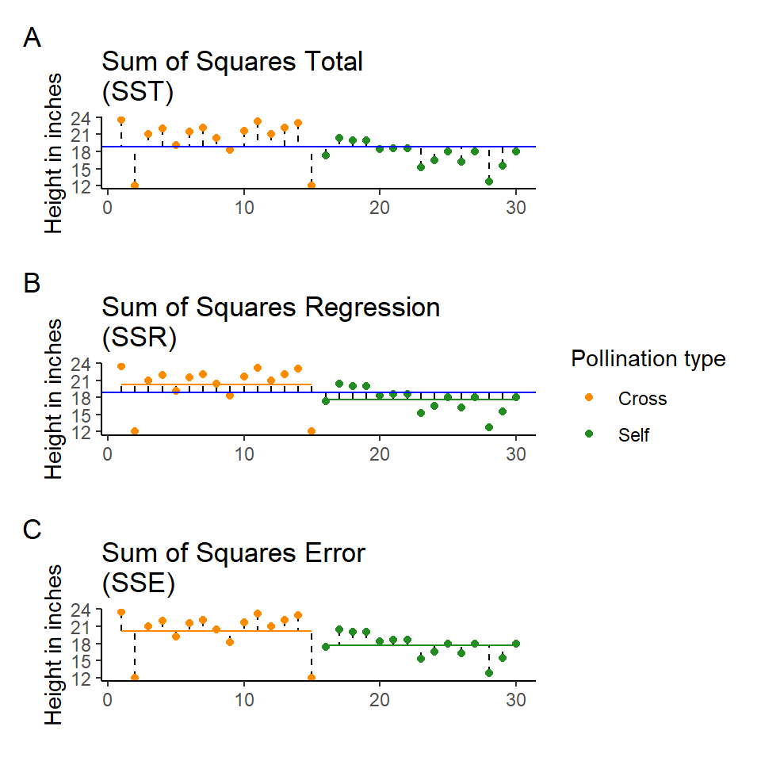
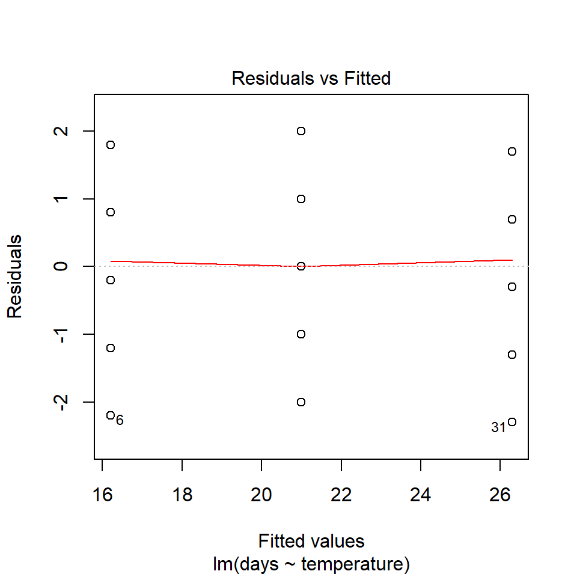
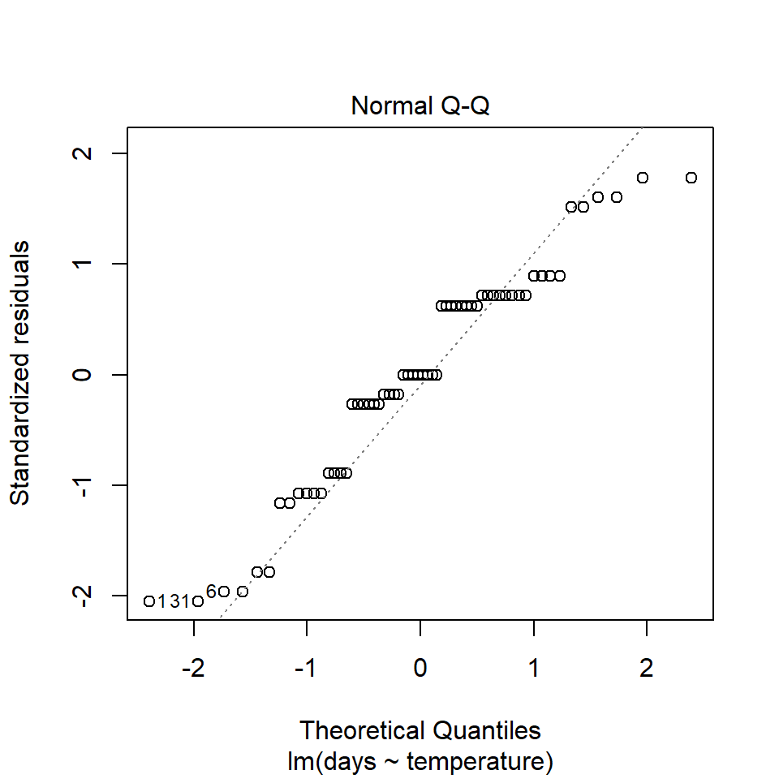
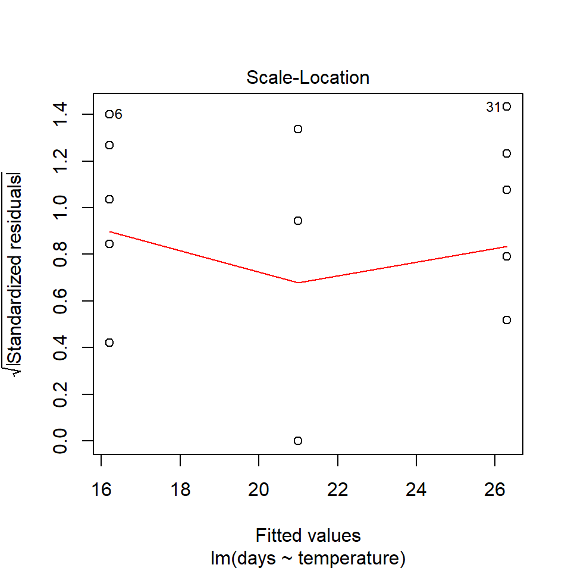
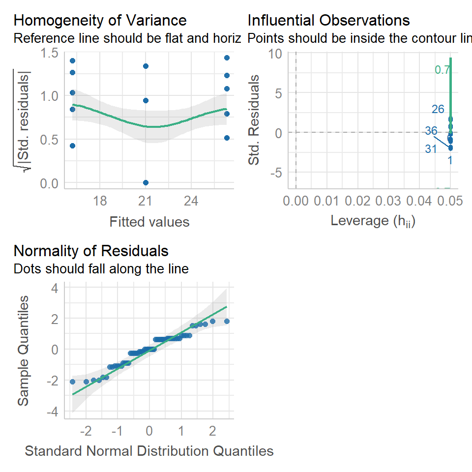
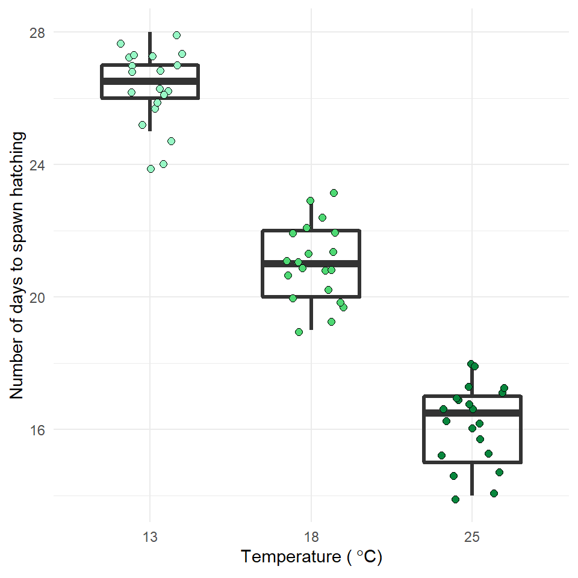
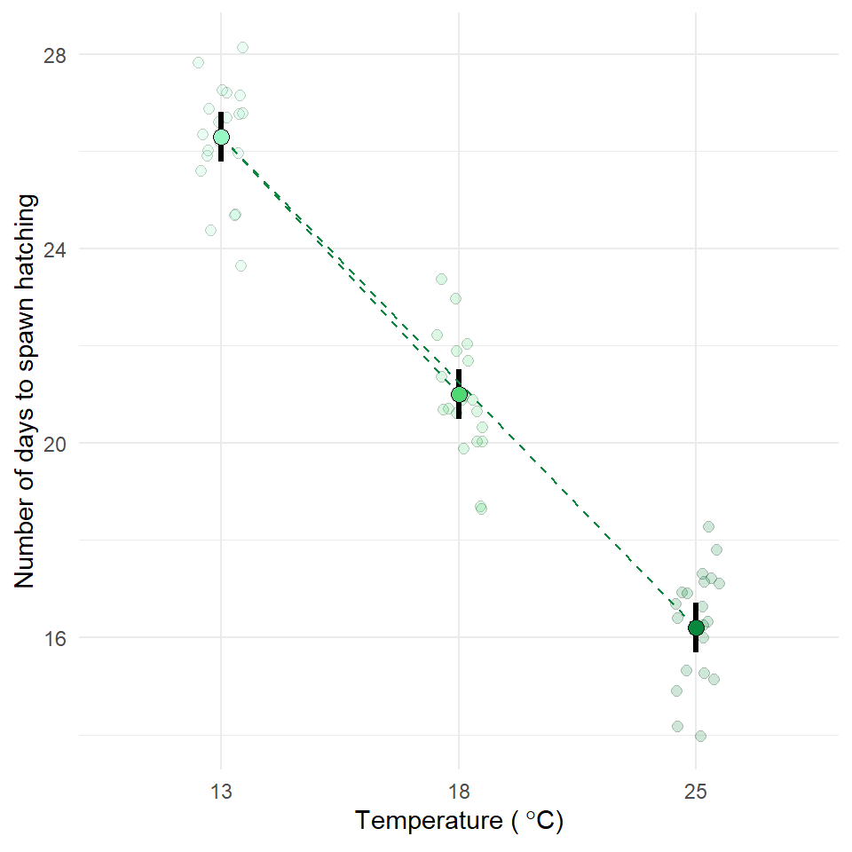

# ANOVA 


## Analysis of Variance (ANOVA)

So far we have used linear models for analyses between *two* 'categorical' explanatory variables e.g. *t*-tests, and for regression with *two* 'continuous' variables. However, as designs become more complicated, the number of comparisons can quickly become overwhelming, working with estimates and intervals alone can become harder. 

As designs become more elaborate the number of pairwise *t*-tests rapidly increases, and therefore our risk of false positives (Type I errors). It is therefore useful to have a complementary approach that first asks if there is any support for a difference between the different means *before* diving into multiple comparisons. This approach is called *analysis of variance* (ANOVA), and although it tends to be associated with categorical data, we will see in the following chapters that the ANOVA is just another type of linear model, so this approach can also be extended to included continuous variables. 

## Maize data

Our simple linear model for the maize data was:

```
lsmodel1 <- lm(height ~ type, data = darwin)
```

This structure of fitting a linear model, with one explanatory variable is also known as a one-way ANOVA. The general strategy of the ANOVA is to quantify the overall variability in the data set and then to divide it into the variability between and within the groups. We can also refer to this as the 'signal-to-noise' ratio, or the variability explained by the slope of the linear model, vs unexplained variance. 

The more of the variation explained by our fitted linear model, the more confident we can be that we have detected a real effect in our estimates of mean differences. This method of fitting a model is called ordinary least squares. 

The least squares model first quantifies the total amount of variation (total sum of squares, SST) by measuring the difference from the individual data points to a reference point (usually the 'grand' mean, see below). 

Next the model quantifies a fitted slope, it aims to produce a slope that produces the least amount of squared residuals to the data points (sum of squares of the regression/ANOVA, SSR/A). 

This then leaves the residual unexplained variation (sum of squares of the error, SSE). 

In this way the model is splitting the overall variability (SST) into signal (SSR) and noise (SSE):

$$ SST = SSR + SSE $$

Remember:

* SST = the sum of squared differences between the data points and the grand mean

* SSR = the sum of the squared differences between the grand mean and the predicted position on the linear model

* SSE = the sum of the squared differences between the predicted position and the observed position




<div class="info">
<p>Least squares quantifies A) total least squares, B) treatment least squares, C) error sum of squares (SST, SSR, SSE). The vertical lines measure the distances, which are then squared and summed. SST is calculated by measuring to the intercept, SSR is calculated by measuring the distance of the estimates to the intercept, SSE is calculated by measuring the distance to the estimates</p>
</div>

### The ANOVA table

If we want to get the ANOVA table for a linear model we can use the `anova()` function:


```r
anova(lsmodel1)
```

<div class="kable-table">

<table>
 <thead>
  <tr>
   <th style="text-align:left;">   </th>
   <th style="text-align:right;"> Df </th>
   <th style="text-align:right;"> Sum Sq </th>
   <th style="text-align:right;"> Mean Sq </th>
   <th style="text-align:right;"> F value </th>
   <th style="text-align:right;"> Pr(&gt;F) </th>
  </tr>
 </thead>
<tbody>
  <tr>
   <td style="text-align:left;"> type </td>
   <td style="text-align:right;"> 1 </td>
   <td style="text-align:right;"> 51.35208 </td>
   <td style="text-align:right;"> 51.352083 </td>
   <td style="text-align:right;"> 5.939518 </td>
   <td style="text-align:right;"> 0.0214145 </td>
  </tr>
  <tr>
   <td style="text-align:left;"> Residuals </td>
   <td style="text-align:right;"> 28 </td>
   <td style="text-align:right;"> 242.08333 </td>
   <td style="text-align:right;"> 8.645833 </td>
   <td style="text-align:right;"> NA </td>
   <td style="text-align:right;"> NA </td>
  </tr>
</tbody>
</table>

</div>


Compare this to the output you get when you use the `summary()` function. You should see that the *F*-value *P*-value and df are all exactly the same. The ANOVA table actually has *far* less information in it, as it contains no information about the biology (estimates in difference, or uncertainty such as standard errors etc.). It is amazing how many times you will see these tables reported, even though they contain the *least* interesting part of the analysis. 

**BUT** they can help us simplify effects where there are more than two levels, but we need to learn how to use them appropriately. 

The ANOVA table has six columns and two rows of information. 

The first column contains the information source, here the signal/regression (first row) and error/noise (second row). 

The second column gives the degrees of freedom, in the first row this is the number of predictors(treatments) (*k - 1*, including intercept), and in the second row the residual degrees of freedom (*N - k*). 

The third column is the sum of squares in the first row this is the SSR, and the second row SSE (remember that SST = SSR + SSE). 

The fourth column is the *mean* sum of squares MSR = SSR/(k-1) & MSE = SSE/(N-k). These are the average amounts of variability per treatment level. 

It's worth stopping briefly at this point and remembering that we have effectively pooled the SSE from *both* treatments to generate the MSE. Linear models always use this pooled variance approach, it can give them greater power for detecting effects with smaller sample sizes, but is the reason why we need homogeneity of variance as an assumption of our model. 

The fifth column is our *F* statistic (the signal-to-noise ratio). It is calculated by dividing the treatment variance by the residual error variance

$$ F =\frac{SSR/(k-1)}{SSE/(N-k)} =  \frac{MSR}{MSE} $$
In our example *F* = 5.9, which means that the estimated signal is nearly six times larger than the estimated noise. 

We can then use this *F* value with our sample size and treatment levels to calculate the probability of observing this ratio of signal to noise if the null hypothesis that there were no effect of treatment is true. 

The probability value can be looked up in an ANOVA table, and is calculated from an *F* distribution. The *F*-test takes sample size into account, and the probability assigned takes into account the degrees of freedom of both the signal and noise.

We can see this if we use the R function `pf()` that this should recreate the exact *P*-value we see in our ANOVA table. 

The first three arguments here are the *F*-value, degrees of freedom for the signal, and noise. The last argument is to set this as a two directional test. 


```r
pf(5.9395, 1, 28, lower.tail=FALSE)
```

```
## [1] 0.02141466
```

It is common to see *P*-values reported with no supporting information (naked *P*-values). But it is impossible to interpret these without knowing: 

1) what test they came from

2) what the observed value of the test was

3) the degrees of freedom. 

So the good (and conventional) way to report this result as an ANOVA would be:

> The height of the cross-pollinated plants was significantly taller than the height of the self-pollinated plants (*F*~1,28~ = 5.9, *P* = 0.02).

**BUT** we know that this way of reporting, emphasises the statistical tests and not the underlying biology. The report doesn't tell us anything about the heights of the plants, the estimated difference between them, or any measure of the uncertainty around this.

> The self pollinated maize plants measured an average of 17.6 [16-19.1] (mean[95% CI]) inches high, while the cross-pollinated plants had a mean height of 20.2 [18.6-21.7] inches -  a difference of 2.6 [-0.4-4.8] inches (one-way ANOVA: *F*~1,28~ = 5.9, *P* = 0.02). 

## Two-way ANOVA

Two way ANOVA (as you might guess) includes **two** explanatory variables. Usually these are treatments of interest, but for this example we will stick with including the pair variable. 


```r
lsmodel2 <- lm(height ~ type + as.factor(pair), data = darwin)
```

And we can look at this table using the `anova()` function again


```r
anova(lsmodel2)
```

<div class="kable-table">

<table>
 <thead>
  <tr>
   <th style="text-align:left;">   </th>
   <th style="text-align:right;"> Df </th>
   <th style="text-align:right;"> Sum Sq </th>
   <th style="text-align:right;"> Mean Sq </th>
   <th style="text-align:right;"> F value </th>
   <th style="text-align:right;"> Pr(&gt;F) </th>
  </tr>
 </thead>
<tbody>
  <tr>
   <td style="text-align:left;"> type </td>
   <td style="text-align:right;"> 1 </td>
   <td style="text-align:right;"> 51.35208 </td>
   <td style="text-align:right;"> 51.352083 </td>
   <td style="text-align:right;"> 4.6138501 </td>
   <td style="text-align:right;"> 0.0497029 </td>
  </tr>
  <tr>
   <td style="text-align:left;"> as.factor(pair) </td>
   <td style="text-align:right;"> 14 </td>
   <td style="text-align:right;"> 86.26354 </td>
   <td style="text-align:right;"> 6.161682 </td>
   <td style="text-align:right;"> 0.5536109 </td>
   <td style="text-align:right;"> 0.8597119 </td>
  </tr>
  <tr>
   <td style="text-align:left;"> Residuals </td>
   <td style="text-align:right;"> 14 </td>
   <td style="text-align:right;"> 155.81979 </td>
   <td style="text-align:right;"> 11.129985 </td>
   <td style="text-align:right;"> NA </td>
   <td style="text-align:right;"> NA </td>
  </tr>
</tbody>
</table>

</div>


Note how some of the degrees of freedom which were initially in the residuals, have now been 'used' by the new term in the more complex model. And that some of the SSE has now been used by SSR explained by the pair term. 

<div class="warning">
<p>As we should already have been able to predict from the last time that we looked at this model structure, the pairing doesn't really do anything ( here <em>F</em>&lt; 1). If pairing did 'nothing' we would still expect an <em>F</em> ratio ~ 1. However, we can see that is actually quite a bit lower than this, and this implies a 'negative variance component' - it has actually <em>increased</em> the relative proportion of SSE compared to SSR here.</p>
<p>When mean squares of the regression are smaller than the residuals it implies a problem with the experimental design. It could be a result of undersampling (more pairs are needed), however it could also be that these pairs were not sampled at random.</p>
</div>

## Summary

ANOVA tables can be built for any linear model. The tables partition the variance into signal(s) and noise, which can be compared using an *F*-test. For complex analyses where many pairwise comparisons could be performed, an initial *F*-test can provide the initial evidence for whether there are any differences at all, reducing the risk of overtesting and the false positives that can be generated. 

## Activity

Write a short R based report (Rmd) using ANOVA to test an experimental hypothesis:

* Set up a new R project for your analysis - get it talking to Github

* Import, clean and analyse your data

* Test an experimental hypothesis

* Produce a data visual summary

* Produce a short write-up

Now is the time to try and put your analysis skills into action. Below are instructions for importing data and setting up a new project to answer the question, does temperature affect frogspawn development? This is your chance to practice: 

**Q. How does frogspawn hatching time vary with temperature?**

Imagine we ran a manipulative experiment.

> A manipulative study is one in which the experimenter changes something about the experimental study system and studies the effect of this change.

We collected newly-layed frogspawn from a pond in the Italian Alps and we brought them back to the lab, where we divided them into 60 water containers. 20 of the containers’ water temperature was kept to 13°C, 20 containers were kept to 18°C and the remaining 20 containers were kept to 25°C. Having a high number of replicates increases our confidence that the expected difference between groups is due to the factor we are interested in. Here, temperature.

We monitored each water container and we recorded hatching times (days until hatching of eggs) in a spreadsheet (here called frogs_messy_data.csv).


```{=html}
<a href="https://raw.githubusercontent.com/UEABIO/data-sci-v1/main/book/files/frogs_messy_data.csv">
<button class="btn btn-success"><i class="fa fa-save"></i> Download frogs_messy_data as csv</button>
</a>
```

* Our response variable is Hatching_time.

* Our explanatory variable is Temperature, with 3 levels: 13°C, 18°C and 25°C.

We want to compare the means of 3 independent groups (13°C, 18°C and 25°C temperature groups) and we have one continuous response variable (Hatching time in days) and one categorical explanatory variable (Temperature). One-way ANOVA is the appropriate analysis!

### Hypothesis

Always make a hypothesis and prediction, before you delve into the data analysis.

A hypothesis is a tentative answer to a well-framed question, referring to a mechanistic explanation of the expected pattern. It can be verified via predictions, which can be tested by making additional observations and performing experiments.

This should be backed up by some level of knowledge about your study system.

In our case, knowing that frogspawn takes around 2-3 weeks to hatch under optimal temperatures (15-20°C), we can hypothesize that the lower the temperature, the longer it will take for frogspawn to hatch. Our hypothesis can therefore be: mean frogspawn hatching time will vary with temperature level. We can predict that given our temperature range, at the highest temperature (25°C) hatching time will be reduced.

<div class="panel panel-default"><div class="panel-heading"> Task </div><div class="panel-body"> 
After setting up your R project, import and tidy your dataset.

Hint: check your data is in a tidy format.

Remember to organise your analysis script - use the document outline feature to help you. </div></div>

<button id="displayTextunnamed-chunk-14" onclick="javascript:toggle('unnamed-chunk-14');">Show Solution</button>

<div id="toggleTextunnamed-chunk-14" style="display: none"><div class="panel panel-default"><div class="panel-heading panel-heading1"> Solution </div><div class="panel-body">

```r
#___________________________----

# SET UP ----
## An analysis of the development time of frogspawn in response to water temperature ----
#___________________________----

# PACKAGES ----
library(tidyverse)
#___________________________----

# IMPORT DATA ----
frogs <- read_csv("data/frogs_messy_data.csv")
#___________________________----

# TIDY DATA ----
frogs <- frogs %>% 
  rename("13" = Temperature13,
         "18" = Temperature18,
         "25" = Temperature25,
         frogspawn_id = `Frogspawn sample id`) %>% 
  pivot_longer(`13`:`25`, names_to="temperature", values_to="days") %>% 
  drop_na(days)
#___________________________----
```
</div></div></div>


<div class="panel panel-default"><div class="panel-heading"> Task </div><div class="panel-body"> 
With the data tidied can you produce a **linear model**, check its assumptions and interpret its findings? </div></div>

<button id="displayTextunnamed-chunk-16" onclick="javascript:toggle('unnamed-chunk-16');">Show Solution</button>

<div id="toggleTextunnamed-chunk-16" style="display: none"><div class="panel panel-default"><div class="panel-heading panel-heading1"> Solution </div><div class="panel-body">

```r
# ANALYSIS ----
lsmodel_frogs1 <- lm(days ~ temperature, data = frogs)

# summary(lsmodel_frogs1)

# anova(lsmodel_frogs1)

broom::tidy(lsmodel_frogs1, conf.int = T)
#___________________________----
```

<div class="kable-table">

<table>
 <thead>
  <tr>
   <th style="text-align:left;"> term </th>
   <th style="text-align:right;"> estimate </th>
   <th style="text-align:right;"> std.error </th>
   <th style="text-align:right;"> statistic </th>
   <th style="text-align:right;"> p.value </th>
   <th style="text-align:right;"> conf.low </th>
   <th style="text-align:right;"> conf.high </th>
  </tr>
 </thead>
<tbody>
  <tr>
   <td style="text-align:left;"> (Intercept) </td>
   <td style="text-align:right;"> 26.3 </td>
   <td style="text-align:right;"> 0.2571777 </td>
   <td style="text-align:right;"> 102.26394 </td>
   <td style="text-align:right;"> 0 </td>
   <td style="text-align:right;"> 25.785011 </td>
   <td style="text-align:right;"> 26.814989 </td>
  </tr>
  <tr>
   <td style="text-align:left;"> temperature18 </td>
   <td style="text-align:right;"> -5.3 </td>
   <td style="text-align:right;"> 0.3637041 </td>
   <td style="text-align:right;"> -14.57228 </td>
   <td style="text-align:right;"> 0 </td>
   <td style="text-align:right;"> -6.028305 </td>
   <td style="text-align:right;"> -4.571695 </td>
  </tr>
  <tr>
   <td style="text-align:left;"> temperature25 </td>
   <td style="text-align:right;"> -10.1 </td>
   <td style="text-align:right;"> 0.3637041 </td>
   <td style="text-align:right;"> -27.76982 </td>
   <td style="text-align:right;"> 0 </td>
   <td style="text-align:right;"> -10.828305 </td>
   <td style="text-align:right;"> -9.371695 </td>
  </tr>
</tbody>
</table>

</div></div></div></div>

<div class="panel panel-default"><div class="panel-heading"> Task </div><div class="panel-body"> 
Can you check the assumptions of your model? </div></div>

<button id="displayTextunnamed-chunk-18" onclick="javascript:toggle('unnamed-chunk-18');">Show Solution</button>

<div id="toggleTextunnamed-chunk-18" style="display: none"><div class="panel panel-default"><div class="panel-heading panel-heading1"> Solution </div><div class="panel-body"><div class="tab"><button class="tablinksunnamed-chunk-18 active" onclick="javascript:openCode(event, 'option1unnamed-chunk-18', 'unnamed-chunk-18');">Base R</button><button class="tablinksunnamed-chunk-18" onclick="javascript:openCode(event, 'option2unnamed-chunk-18', 'unnamed-chunk-18');"><tt>tidyverse</tt></button></div><div id="option1unnamed-chunk-18" class="tabcontentunnamed-chunk-18">

```r
plot(lsmodel_frogs1)
```


</div><div id="option2unnamed-chunk-18" class="tabcontentunnamed-chunk-18">

```r
performance::check_model(lsmodel_frogs1,
                         check = c("qq", "outliers", "homogeneity"))
```


</div><script> javascript:hide('option2unnamed-chunk-18') </script></div></div></div>


<div class="panel panel-default"><div class="panel-heading"> Task </div><div class="panel-body"> 
Can you produce a suitable Figure for this dataset? </div></div>

<button id="displayTextunnamed-chunk-20" onclick="javascript:toggle('unnamed-chunk-20');">Show Solution</button>

<div id="toggleTextunnamed-chunk-20" style="display: none"><div class="panel panel-default"><div class="panel-heading panel-heading1"> Solution </div><div class="panel-body">
There are multiple ways to present the same data, equally valid, but emphasising different concepts. For example this first figure uses a boxplot and data points to illustrate the differences. Remember the median and IQR are essentially descriptive statistics, not inferential.

<div class="figure" style="text-align: center">

<p class="caption">(\#fig:unnamed-chunk-28)Frogspawn hatching times at 13, 18 and 25 degrees Celsius. Boxplot displays median, hinges are first and third quartiles, whiskers extend from the hinge to 1.5X the interquartile range. Points represent individual frogspawns.</p>
</div>

Whereas the next figure, uses the `emmeans()` package to produce estimate means and confidence intervals from the `lm()` and therefore is the produce of inferential statistics, this figure illustrates the estimates of our model rather than the parameters of our sample.

Neither method is 'best'. 


<div class="figure" style="text-align: center">

<p class="caption">(\#fig:unnamed-chunk-29)Time to hatching is inversely related to temperature in frogspawn. Circles represent estimated mean hatching times with 95% confidence intervals from a one-way ANOVA (F~1,28~ = 385.9, P < 0.001). Dashed lines indicate the slope of the mean difference between 13-18 degrees and 13-25 degrees Celsius. Faded points represent individual data points.</p>
</div>
</div></div></div>


<div class="panel panel-default"><div class="panel-heading"> Task </div><div class="panel-body"> 
Can you write a summary of the **Results**? </div></div>

<button id="displayTextunnamed-chunk-22" onclick="javascript:toggle('unnamed-chunk-22');">Show Solution</button>

<div id="toggleTextunnamed-chunk-22" style="display: none"><div class="panel panel-default"><div class="panel-heading panel-heading1"> Solution </div><div class="panel-body">

Increasing temperatures had a clear effect on reducing the time taken for frogspawn to hatch (one-way ANOVA: *F*~2,57~ = 385.9, *P* < 0.001). At 13$^\circ$ C the mean time to hatching was 26.3 days [25.8-26.8 95% CI], this reduced by an average of 5.3 days [4.57 - 6.02] at 18$^\circ$ C and by 10.1 days [9.37 - 10.82] at 25$^\circ$ C. 
</div></div></div>


